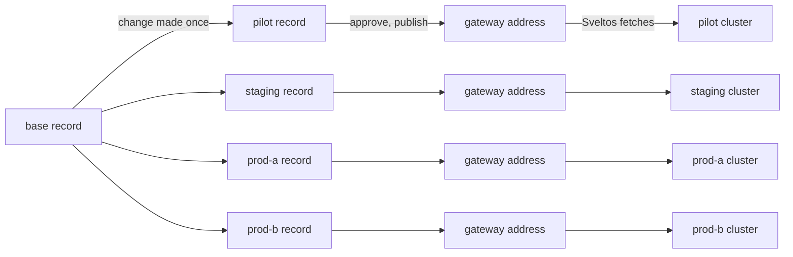
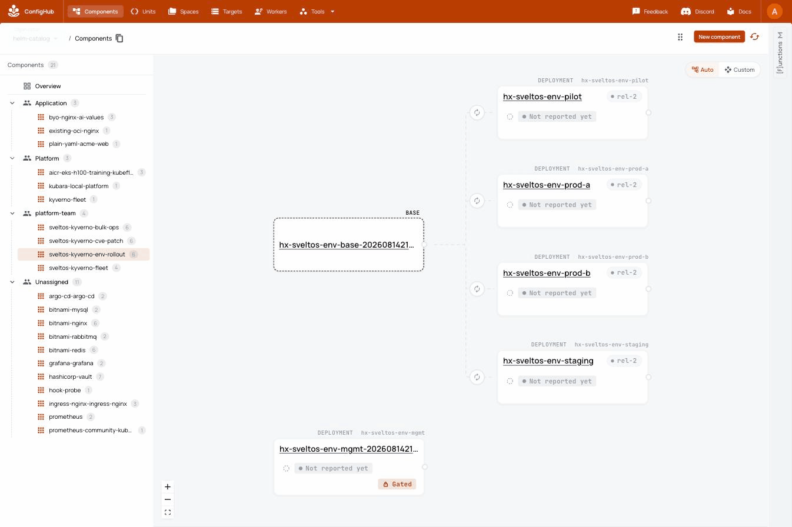
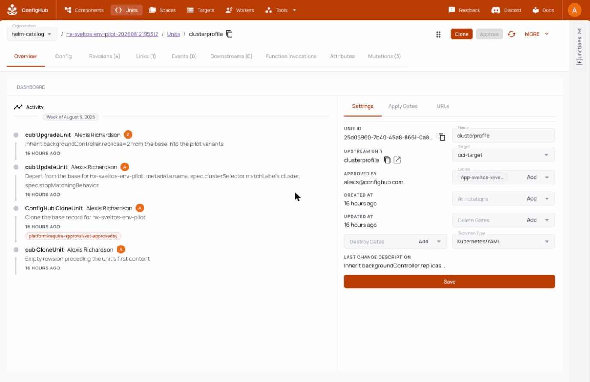

# Sveltos on ConfigHub

If you run more than a handful of Kubernetes clusters and want every change
to them reviewed, approved, and answerable afterwards, this repository is a
working, recorded example of exactly that.

It joins two tools. [ConfigHub](https://confighub.com) is a configuration
database: governed records with revision history and approval gates, where a
fleet is one shared base plus per-cluster variants, clones of that base
carrying only their declared differences. [Sveltos](https://projectsveltos.io)
is an open-source Kubernetes add-on controller: it runs on one management
cluster, delivers to the others, and keeps them converged, repairing drift
without being asked. The join is short: every approved revision is published
as an OCI image on ConfigHub's gateway, and Sveltos fetches that image and
delivers it to the one cluster its record addresses.

Sixty seconds to watch it check itself, with no account, no cluster, and no
network:

```bash
git clone https://github.com/confighub/sveltos-confighub
cd sveltos-confighub
npm run verify
```

The runs in this repository pin **Sveltos v1.13.0**
([manifest](examples/sveltos/env-rollout/source-lock.yaml)). Reading a
release from the ConfigHub gateway additionally needs an addon controller
that decompresses gzipped layers, which is
`projectsveltos/addon-controller:v1.13.0-ch` until that fix ships in a
release. The [gateway probe](docs/planning/remote-url-oci-probe.md) measured
both, and every receipt records the image its run used.

This is the fleet companion to
[kubara-confighub](https://github.com/confighub/kubara-confighub), which
governs a platform one cluster at a time. This repository governs one change
across many clusters.

## What the delivery path is

1. Config comes from ConfigHub, where a reviewed record is stored, checked,
   and held at an approval gate.
2. A named person approves one exact revision, and ConfigHub publishes it as
   an OCI image on its OCI gateway.
3. Sveltos on the management cluster fetches that image and sends the
   reviewed profile to the one cluster its selector addresses.
4. Sveltos keeps that cluster aligned and repairs drift.

Each cluster's lane runs the whole way on its own record, its own approval,
its own gateway address, and its own digest. Sveltos on the management
cluster is the carrier for every lane:



No GitOps controller and no intermediate registry take part. Promotion does
not change the delivery wiring at all: publishing the approved release moves
the tag, and the fleet follows, so approval alone moves the fleet.

## Why we did this

Fleet tools can move configuration to many clusters. The harder question is
what reached them and who agreed to it. Three answers here are unusual
enough to be the point of the repository.

- **A record and a cluster stand one to one.** Sveltos maps one profile to
  many clusters by design, which is what lets it scale. This repository
  narrows that on purpose: every cluster has its own governed record,
  including the management cluster, and the selector inside each record
  addresses exactly one cluster. A record covering two clusters cannot be
  approved for one and held for the other, cannot be rolled back for one
  alone, and cannot say which of them runs which revision today. The records
  are variants of a shared base carrying only their own departures, so a
  change made once still flows to all of them. Chapter three is recorded
  this way; the other chapters are being reworked to match, and their
  receipts say which shape each one recorded.
- **The rollout definition is itself reviewed configuration.** A wave is a
  label query over the per-cluster records, not a pipeline object beside
  them, and widening a rollout means approving the next cluster's record.
  Each approval goes through the same gate as any other change and lands
  that record at its own new digest.
- **Approval binds to an exact revision.** It is not a sync button and not a
  paused bundle. Approving yesterday's revision authorises nothing about
  today's, and the bytes that shipped are the bytes that were approved.
- **The matrix keeps four facts apart** that a status page usually collapses
  into one green tick: which revision each cluster should run, which release
  was published, what the controller fetched, and what Kubernetes reports.

## See the result first

This is the recorded chapter-three fleet as ConfigHub shows it: one base
record on the left, one deployment record per cluster on the right, four
workload clusters and the management record, every record at its second
release after one reviewed change to the base. The base and management
records carry armed gates:



The "Not reported yet" chips are the honest part: ConfigHub publishes and
never connects to the clusters, so live state is not its claim to make.
Sveltos knows the answer per cluster, and teaching ConfigHub to show
Sveltos's reading in Sveltos's own words is proposed upstream.

One record up close, the pilot cluster's, with the whole story in its
activity: cloned from the base behind the approval gate, departed in
exactly three fields (its name, the selector line that addresses its
cluster, its removal behaviour), then inheriting the reviewed base change.
The approval binds to that record's exact revision:



Chapter four is fleet patch day with evidence: the patched chart's
provenance was checked against the reviewed digest before anything was
stored, the bump moved through all three environments, and a
[coverage audit](data/sveltos-cve-patch/matrix.md) named every cluster and
confirmed each runs the patched version.

Chapter five wrote one reviewed edit into every record in a single pass and
closed with a [zero-drift audit](data/sveltos-bulk-ops/matrix.md). Its
receipt records the shape of that fan-out honestly: one reviewed edit, three
record updates, three approvals, and three release publishes, because each
Space publishes its own release.

Chapter three now governs one record per cluster over a shared base, so
ConfigHub answers which cluster runs which revision from its own records
rather than from a label query Sveltos resolves at delivery time. Each wave
selects its variants with one query and approves that set in one operation,
and ConfigHub records one approval per cluster and one release for every
cluster it delivers to. That design is recorded live, so every observed cell
in the [per-cluster matrix](data/sveltos-env-rollout/matrix.md) comes from the
committed [receipt](runs/sveltos-env-rollout-proof/receipt.yaml): four
clusters at four checkpoints, each carrying its own departure through the
change.

Chapters one and two are recorded in the
[two-wave proof](data/sveltos-oci-delivery-proof/summary.md): ConfigHub held
a pilot profile until its exact revision was approved, and one approved
selector change added the second cluster at a new digest. That recording
predates the gateway and carried its OCI through a GitOps controller and a
temporary registry, which its receipt states. The governance half stands as
recorded, and the delivery half awaits a gateway re-record.

The [fleet rehearsal](examples/sveltos/fleet-rehearsal/README.md) proves the
delivery machinery on a five-cluster fleet with no ConfigHub account at all,
and records its phase timings.

## The five chapters

1. **[Kyverno across the fleet](examples/sveltos/kyverno-fleet/README.md)**
   installs admission policy through a reviewed record with an approval
   gate. Recorded live on the earlier delivery path.
2. **The canary**, in the same example: the reviewed profile selected only
   the pilot cluster, and one approved selector change added the second
   cluster at a new OCI digest. Recorded live on the earlier delivery path.
3. **[Environment rollout](examples/sveltos/env-rollout/README.md)** promotes
   one reviewed values change pilot to staging to production, with one
   governed record per cluster and no record addressing two clusters.
   Recorded live on the gateway.
4. **[CVE patching](examples/sveltos/cve-patch/README.md)**: one reviewed
   version bump with digest-bound provenance, closed by a coverage audit
   that proves no cluster was missed. No vulnerability scanning is claimed.
   Recorded live.
5. **[Bulk operations](examples/sveltos/bulk-ops/README.md)**: one reviewed
   edit written to every record in one pass, closed by a zero-drift audit.
   Recorded live.

All five chapters have been recorded live. Every observed cell in every
matrix comes from a committed receipt, and each receipt records the addon
controller image its run used. Chapters one and two were recorded on the
earlier delivery path, and the rest fetch from the gateway.

## How to run it

To stand this shape up for your own fleet, at any size, read
[Run your own fleet on one record per cluster](docs/user/run-your-own-fleet.md):
the shape, what a change costs at N clusters, adding and removing a cluster,
and the operational limits this repository already measured.

Every check runs with no account, no cluster, and no network, and the
repository has no npm dependencies:

```bash
git clone https://github.com/confighub/sveltos-confighub
cd sveltos-confighub
npm run verify
```

The fleet rehearsal builds its own clusters and needs no ConfigHub account:

```bash
HELM_EXPT_ALLOW_LIVE_SVELTOS_REHEARSAL=1 npm run sveltos-fleet-rehearsal:run
```

The governed chapters need the `cub` CLI and one authenticated context.
Install it with `curl -fsSL https://hub.confighub.com/cub/install.sh | bash`,
then `cub auth login`. Confirm the approval wiring before building a fleet:

```bash
CUB_CONTEXT=my-policy npm run sveltos-gate:probe
```

Then record chapter three:

```bash
HELM_EXPT_ALLOW_LIVE_SVELTOS_ENV_ROLLOUT=1 \
CUB_CONTEXT=my-policy \
SVELTOS_ADDON_CONTROLLER_IMAGE=docker.io/projectsveltos/addon-controller:v1.13.0-ch \
npm run sveltos-env-rollout-proof:run
```

The recorded runs used the maintainers' catalog organization, which owns the
approval policy space and trigger filter the runners check for. In another
organization, create that wiring first from
[the committed policy](config-catalog/policies/catalog-standard.yaml). Each
runner checks its preconditions and stops early with a named reason instead
of failing after the fleet build. Fleet proofs run serially, never in
parallel.

Requirements: node 22 or newer, python3 with pyyaml, and tar. The live lanes
additionally use cub, docker, kind, kubectl, helm, curl, and oras.

## What this does not claim

It does not claim a cumulative failure budget, an automated verification
step between stages, a timeout on a stalled wave, or a single action that
halts and reverses a rollout across the fleet. Rollback here restores one
target to an exact revision, which is a different thing.

## Provenance

This work was extracted from
[confighub/helm-expt](https://github.com/confighub/helm-expt) with paths
preserved, so every committed receipt verifies here unchanged. The planning
brief is [docs/planning/sveltos-fleet-brief.md](docs/planning/sveltos-fleet-brief.md)
and the one-page story is
[docs/demo/sveltos/fleet-chapters.md](docs/demo/sveltos/fleet-chapters.md).
