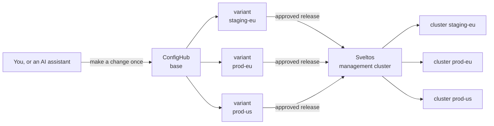
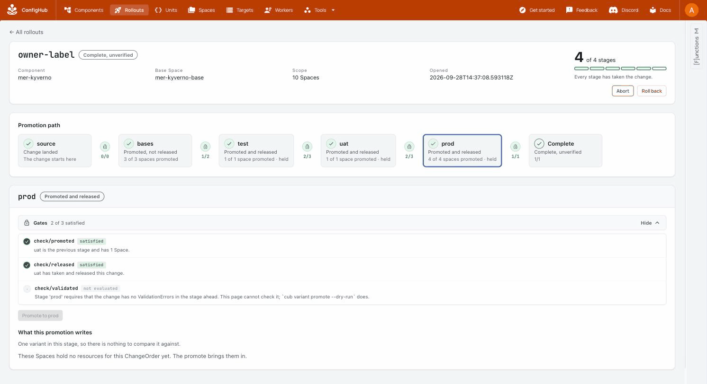
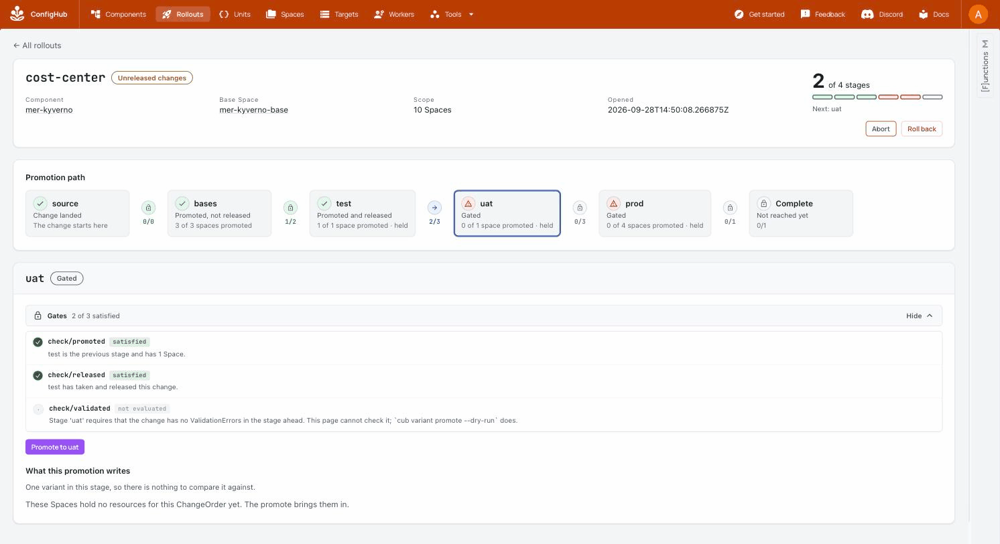
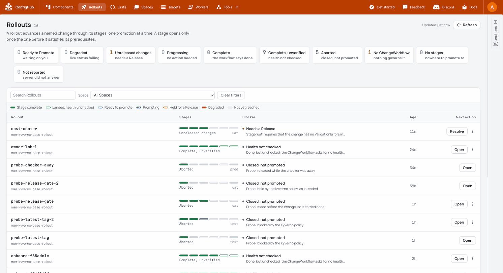
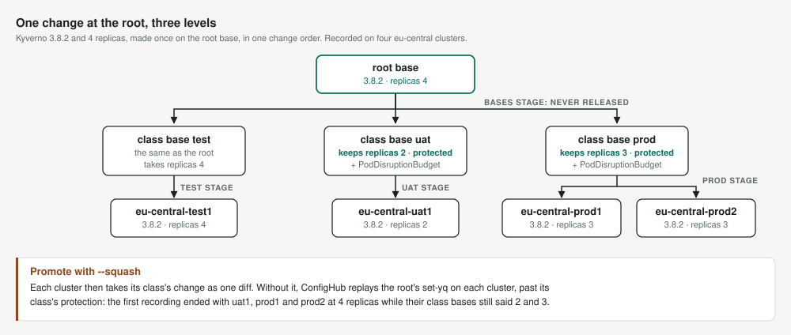
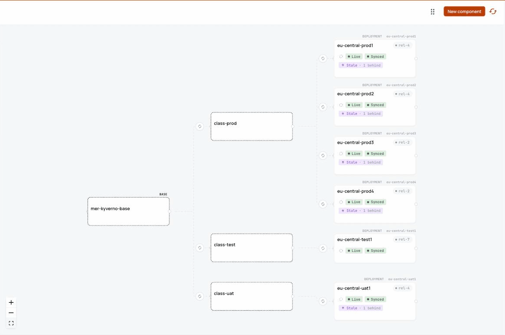
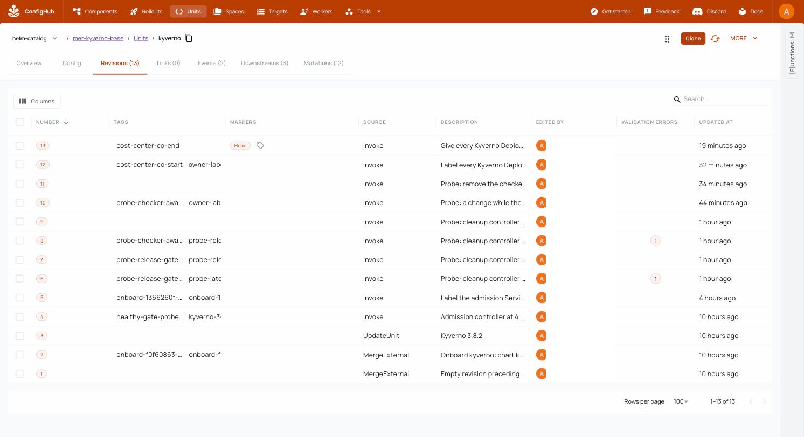

# Sveltos on ConfigHub

Run your Kubernetes add-ons with [Sveltos](https://projectsveltos.io), and
manage every change to them in [ConfigHub](https://confighub.com): reviewed,
approved, rolled out staging before prod, and on record afterwards.

This repository has three things:
- **the integration:** how Sveltos and ConfigHub work together;
- **the plugin, `cub sveltos`:** it moves a fleet you already run with Sveltos
  onto ConfigHub;
- **examples you can run on your laptop.**

## How it fits together


```mermaid
flowchart LR
  you["You, or an AI assistant"] -->|"make a change once"| base["ConfigHub<br/>base"]
  base --> a["variant<br/>staging-eu"]
  base --> b["variant<br/>prod-eu"]
  base --> c["variant<br/>prod-us"]
  a -->|"approved release"| sv["Sveltos<br/>management cluster"]
  b -->|"approved release"| sv
  c -->|"approved release"| sv
  sv --> ca["cluster staging-eu"]
  sv --> cb["cluster prod-eu"]
  sv --> cc["cluster prod-us"]
```

- **ConfigHub holds what each cluster runs.** For every add-on, a **base**
  holds the Kubernetes objects its Helm chart renders to, and each cluster has
  a **variant** of that base.
- **You change the base once.** The change reaches every cluster's variant,
  stage by stage: staging first, then prod, with an approval in each stage.
- **Sveltos delivers.** For each cluster, one small Sveltos profile fetches
  that cluster's latest approved release from ConfigHub and applies it. If
  anyone edits the cluster by hand, Sveltos puts it back.

You keep Sveltos. You gain a review of every change, a record of which
revision each cluster runs, and a rollout order that ConfigHub enforces.

## The plugin: `cub sveltos`

```bash
cub plugin install confighub/sveltos-confighub
cub plugin install confighub/cub-helm        # renders charts; v0.1.1 or newer
```

| Command | What it does |
| --- | --- |
| `cub sveltos plan` | Reads your Sveltos ClusterProfiles and clusters, and shows what ConfigHub would hold. **Changes nothing**, and needs no account or cluster. |
| `cub sveltos apply` | Writes the plan out as files and a script, `apply.sh`, for you to read and then run. Writes `handover.sh` too, if your profiles are live. |
| `cub sveltos compare` | Checks that what ConfigHub will deliver to a cluster is exactly what Helm installed there. `handover.sh` runs it for you. |
| `cub sveltos status` | Tells ConfigHub what Sveltos delivered to each cluster: synced, healthy, and which release it runs. |
| `cub sveltos watch` | Proposes variants for each cluster that joins, and releases them once a person approves in ConfigHub. |
| `cub sveltos check` | Runs a policy check, such as Kyverno, on a change in one stage, and records the verdict in ConfigHub. Each stage's release can require a Pass. |
| `cub sveltos version` | Prints the version. The current release is **v0.6.0**; see [what's new](docs/whats-new.md). |

After onboarding you don't need the plugin day to day: changes are made with
ConfigHub's own `cub` commands, shown below.

You need the `cub` CLI (`cub auth login`), `kubectl` access to your Sveltos
management cluster, and Sveltos v1.14.0 or newer.

## What you can do with it

### 1. Bring the fleet you already run into ConfigHub

Export what Sveltos knows, and see the plan. Nothing changes yet:

```bash
kubectl get clusterprofiles,sveltosclusters -A -o yaml > my-fleet.yaml
cub sveltos plan my-fleet.yaml --stage-label env --stages staging,prod
```

```text
kyverno  (selects env In [staging, prod])
  base     sveltos-kyverno-base  holds what its charts and policies render to, and delivers to no cluster:
    unit   kyverno  chart kyverno 3.8.1 from https://kyverno.github.io/kyverno: 71 objects (22 CRDs)
  stage staging
    staging-eu   variant sveltos-kyverno-staging-eu  ->  Target sveltos-targets/staging-eu
  stage prod
    prod-eu      variant sveltos-kyverno-prod-eu  ->  Target sveltos-targets/prod-eu
    prod-us      variant sveltos-kyverno-prod-us  ->  Target sveltos-targets/prod-us
```

Then write the steps, read them, and run them:

```bash
cub sveltos apply my-fleet.yaml --stage-label env --stages staging,prod --out onboard
MGMT_CONTEXT=<your management cluster context> bash onboard/apply.sh
MGMT_CONTEXT=<your management cluster context> bash onboard/handover.sh   # if your profiles are live
```

The handover moves each cluster over to ConfigHub with nothing reinstalled.
Before it changes anything, it checks that your profiles are still what you
exported, and that each cluster runs exactly what ConfigHub will deliver. If
not, it stops and says why.


### 2. Start something new

You don't need a profile that already runs. Write the ClusterProfile you
would have given Sveltos: which clusters, by label, and which chart. It is
only a description; you never apply it to the management cluster.

```yaml
apiVersion: config.projectsveltos.io/v1beta1
kind: ClusterProfile
metadata:
  name: cert-manager
spec:
  clusterSelector:
    matchLabels:
      env: prod                     # every production cluster
  syncMode: ContinuousWithDriftDetection
  helmCharts:
    - repositoryURL: https://charts.jetstack.io
      repositoryName: jetstack
      chartName: jetstack/cert-manager
      chartVersion: v1.21.2
      releaseName: cert-manager
      releaseNamespace: cert-manager
      helmChartAction: Install
      values: |
        crds:
          enabled: true
        startupapicheck:
          enabled: false
```

```bash
kubectl get sveltosclusters -A -o yaml > clusters.yaml
cub sveltos plan cert-manager.yaml clusters.yaml --stage-label env --stages staging,prod
cub sveltos apply cert-manager.yaml clusters.yaml --stage-label env --stages staging,prod --out cert-manager
MGMT_CONTEXT=<your management cluster context> bash cert-manager/apply.sh
```

ConfigHub gets a base for cert-manager and a variant for each production
cluster. Sveltos installs it on those clusters and nowhere else. On kind it
was running on both production clusters about 75 seconds after `apply.sh`
started.

### 3. Roll a change out to every cluster, staging first

Make the change once, on the base. Here, four replicas for Kyverno's
admission controller:

```bash
cub function set --space sveltos-kyverno-base --unit kyverno --change-desc "4 replicas" -- \
  set-yq '(select(.kind == "Deployment" and .metadata.name == "kyverno-admission-controller") | .spec.replicas) = 4'
cub changeorder create --space sveltos-kyverno-base replicas-4 \
  --change-workflow sveltos-kyverno-base/rollout --description "4 replicas"
```

Then take it through the stages. In each stage you promote, approve and
publish:

```bash
cub variant promote --change-order sveltos-kyverno-base/replicas-4 --target-stage staging --squash
cub variant approve --change-order sveltos-kyverno-base/replicas-4 --stage staging
cub release publish sveltos-kyverno-staging-eu --revision ChangeOrder:sveltos-kyverno-base/replicas-4
```

Sveltos delivers it to staging within a minute. ConfigHub refuses to start
prod before staging has released the change:

```text
Failed: unable to promote to stage 'prod', Variant 'staging-eu' has taken change order 'replicas-4' but has not released it
```

This is a rollout in ConfigHub once it is done. Here it is a label added to
every Kyverno Deployment on the Meridian kind fleet. It was promoted through
the class bases, then test, uat and prod, and released in each stage after an
approval:



### 4. Check every change against your policies

Run your Kyverno policies on a change before it ships. Plan with a policy
trigger and a required check:

```bash
cub sveltos apply onboard/profiles.yaml clusters.yaml --stage-label env --stages staging,prod \
  --policy platform-policies/policy-triggers --require PolicyCheck --out onboard
```

- `--policy` runs your Kyverno check on every change, in every base and
  variant. A change that fails carries an error, and ConfigHub will not
  promote it past its stage or release it.
- `--require PolicyCheck` makes each stage's release wait for a recorded
  Pass. Record one after each promotion:

```bash
cub sveltos check --change-order sveltos-kyverno-base/replicas-4 --stage staging \
  --worker platform-policies/kyverno-checker vet-kyverno-server
```

On the Meridian kind fleet, a change that put Kyverno's cleanup controller on
`:latest` was stopped before test:

```text
unable to promote to stage 'test', Variant 'class-test' has ValidationErrors on the Revisions change order 'probe-latest-tag' marks: kyverno (mer-policies/kyverno/vet-kyverno-server)
```

A policy trigger alone can let a change through while its checker is away.
In our test that happened at once, not after the six hours ConfigHub
documents. So gate releases on the required check. [Check every change
against your policies](docs/user/policy-checks.md) has the setup and what was
measured.

A rollout part-way through, with test released and uat waiting on its gates.
`check/validated` is the policy gate: ConfigHub checks it when you promote.



Every rollout, with what holds each one. The ones marked "blocked by the
Kyverno policy" are changes the policy stopped before they reached a cluster:



### 5. Upgrade a chart, and review exactly what changes

`apply.sh` records the command each chart was rendered with. Render the new
version the same way, and store it on the base:

```bash
cub helm template kyverno kyverno --repo https://kyverno.github.io/kyverno --version 3.8.2 \
  --namespace kyverno --create-namespace -f onboard/kyverno/kyverno.values.yaml \
  | grep -vxF '$comment$head$: ""' > kyverno.yaml
cub unit update --space sveltos-kyverno-base kyverno kyverno.yaml --change-desc "Kyverno 3.8.2"
cub unit diff --space sveltos-kyverno-base kyverno --from=-1 -o mutations
```

The review lists each changed field, object by object. It shows the chart's
new images, and anything else the chart changed besides your values, such as
new RBAC rules or CRDs. Here is part of the GPU operator's upgrade from
v26.3.1 to v26.7.0:

```text
Resource: nvidia.com/v1/ClusterPolicy /cluster-policy
  ~ [Update] spec.driver.version
  ~ [Update] spec.toolkit.version
  ~ [Update] spec.devicePlugin.version
Resource: apiextensions.k8s.io/v1/CustomResourceDefinition /gpuclusters.nvidia.com
  + [Add]
```

Then roll it out as in 3.

### 6. Give each environment, or each kind of cluster, its own settings

If you keep one Sveltos profile per environment (say `kyverno-test`,
`kyverno-uat`, `kyverno-prod`), onboard them as one add-on with a **class
base** per environment:

```bash
cub sveltos plan my-fleet.yaml --class-label class --stage-label class --stages test,uat,prod
```

Each class base holds only what its class differs in, such as its replica
count or an extra PodDisruptionBudget, and keeps it protected. A change made
once at the root reaches every class, and each class keeps what it protects.
The same works for GPU types: one class per accelerator.



In ConfigHub the same tree is the component's map: the root base, a class
base per class, and a variant per cluster, each with its live status from
Sveltos and how far behind a rollout it is.



### 7. Add a new cluster

Register and label the new cluster as you always have. **Nothing ships
yet**: in this setup, a label alone deploys nothing. Keep the watcher running
against your management cluster, with the options you planned with:

```bash
cub sveltos watch onboard/profiles.yaml --out onboard --context <your management cluster context> --stage-label env --stages staging,prod
```

When a profile selects the new cluster, the watcher gives it its own variant,
with every change made since onboarding, and approves nothing:

```
prod-us joined kyverno (env=prod, region=us): proposed sveltos-kyverno-prod-us in stage prod
kyverno waits for approval in stage prod: cub variant approve --change-order sveltos-kyverno-base/onboard-1a2b3c4d --stage prod
```

Someone runs that `cub variant approve`. On its next look the watcher
publishes the release and applies the cluster's delivery profile, and Sveltos
delivers. Labels still decide what is proposed; a person decides what ships. A
cluster labelled by mistake gets nothing until someone approves it, and a
cluster no profile selects is named and gets nothing.

On the Meridian kind fleet, a prod cluster registered at 13:06 was proposed
at 13:10 and waited. After the approval at 13:16, it was delivered and healthy
by 13:20 ([the recording](examples/meridian-slice/join-2026-09-28.log)).

Without the watcher, plan and apply again from the profiles `apply` saved.
`apply.sh` then approves the release itself:

```bash
kubectl get sveltosclusters -A -o yaml > clusters.yaml
cub sveltos apply onboard/profiles.yaml clusters.yaml --stage-label env --stages staging,prod --out onboard
MGMT_CONTEXT=<your management cluster context> bash onboard/apply.sh
```

### 8. See what every cluster runs, whether it is healthy, and who changed it

```bash
cub space list --where "Labels.Cluster = 'prod-eu'"                  # everything on prod-eu
cub unit data --space sveltos-kyverno-prod-eu kyverno                # the exact objects it runs
cub revision list --space sveltos-kyverno-prod-eu kyverno            # every change, with who and why
cub changeorder get --space sveltos-kyverno-base replicas-4          # where a rollout has got to
cub sveltos status --context <management cluster context> --watch    # live status, from Sveltos
```

`cub sveltos status` writes what Sveltos delivered to each cluster into
ConfigHub, as its live status:
- **Synced and Healthy** once the latest release is applied and its workloads
  are available;
- **OutOfSync** while a newer release waits.

A change workflow can then hold each stage until the one before it is
healthy. On kind, ConfigHub refused to promote to uat while test's new
release was not applied yet.

Each change carries its author and a reason. Each stage's approval is
recorded. ConfigHub's refusals come in its own words, and that's the
record an audit needs.

Every revision of the root's Kyverno unit, with the change order that carried
it, its reason, who made it and whether it failed a policy check (the two
marked 1). Author names are hidden here.



### 9. Run it at business size

Sveltos brings the same three levels to a large fleet: a root base, class
bases, and a variant per cluster. That's the shape of ConfigHub's
**Meridian** demo fleet: 99 clusters across 8 regions and 4 classes.

The [Meridian slice](examples/meridian-slice/README.md) runs four of its
clusters for real, delivered by Sveltos. One change at the root reached every
class, test before uat before prod, and each class kept its own settings.
However big the fleet, a change costs the same: one edit, then one promotion
and one approval per stage.

### 10. Work with an AI assistant

Every step is a `cub` or `kubectl` command, so an assistant in your terminal
can do the work:

| You ask | It runs |
| --- | --- |
| "What would ConfigHub hold for my fleet?" | `cub sveltos plan …` |
| "Upgrade Kyverno to 3.8.2, and show me what changes" | `cub helm template …`, `cub unit update …`, `cub unit diff … -o mutations` |
| "Four replicas, for uat only" | `cub function set …` on uat's class base, then `cub unit set-protection …` |
| "Roll it out" | `cub changeorder create …`, then `cub variant promote … --squash` into each stage |
| "Does it pass our policies in staging?" | `cub sveltos check --change-order … --stage staging … vet-kyverno-server` |

**Approval stays with people.**
- Each stage's release waits for `cub variant approve`.
- ConfigHub refuses a stage out of order.
- Set `AllowAuthors: false` in the change workflow, and whoever made a change,
  person or assistant, cannot approve it.

That's what makes a change an assistant prepared safe to accept.

## Try it on your laptop

Each example builds its own [kind](https://kind.sigs.k8s.io) clusters,
installs stock Sveltos v1.15.0, and runs the whole story against your
ConfigHub organization. Each has a recorded log of a real run.

| Example | What it shows |
| --- | --- |
| [Onboarding](examples/onboard/README.md) | Three live Sveltos profiles (Kyverno, its policies, ingress-nginx) handed over with nothing reinstalled. A Kyverno upgrade, staging before prod. A new cluster joining. |
| [The GPU operator](examples/gpu-operator/README.md) | NVIDIA's GPU operator on exactly the clusters approved for it; a mislabelled cluster gets nothing. The operator and driver upgrade reaches staging before prod. |
| [A slice of Meridian](examples/meridian-slice/README.md) | Three levels, from one Sveltos profile per class. One change at the root reaches every class, and each keeps its own replicas. |

```bash
node examples/onboard/kind-fleet.mjs      # build the kind fleet
bash examples/onboard/run.sh              # run the story
```

Every check in the repository also runs offline, with no account and no
cluster: `npm run verify` and `go test ./...`.

## Documentation

- [Onboard your Sveltos fleet](docs/user/onboard-your-sveltos-fleet.md): the
  full guide, from plan to handover to changes afterwards.
- [Check every change against your policies](docs/user/policy-checks.md):
  Kyverno before anything ships, the two gates, and what happens when the
  checker is away.
- [What's new](docs/whats-new.md): what 0.5 and 0.6 changed, and how to move
  from 0.4.
- [chartrender](chartrender/README.md): the chart rules, as a Go package for
  other tools.
- [Before 0.5](docs/chapters.md): how this integration worked before it
  rendered charts into objects, kept for reference.

## Status

`cub sveltos` v0.6.0 is tested on kind with stock Sveltos v1.15.0. It has not
run in a production fleet yet. The policy gates and `cub sveltos check` are on
main, not released yet.

To stop a rollout part-way, abort its change order, then undo it in each Space
it reached with `cub variant demote`. There is no single command that does
this across the fleet yet.
