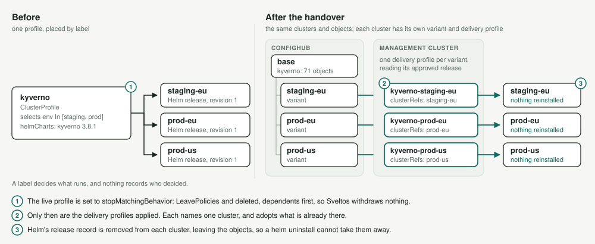
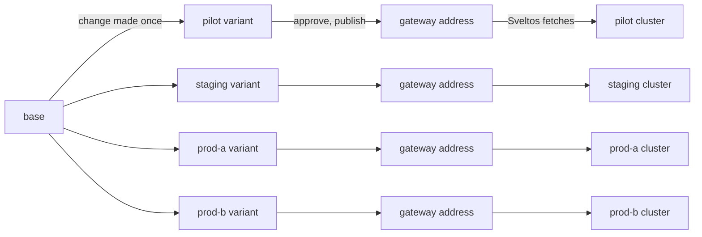
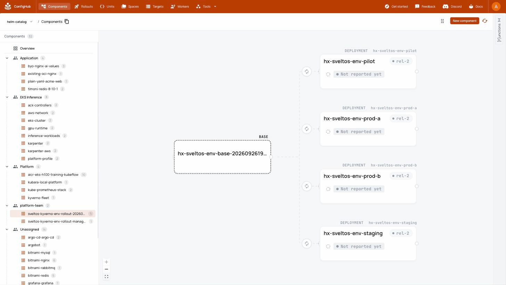
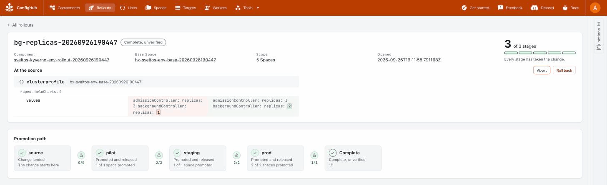
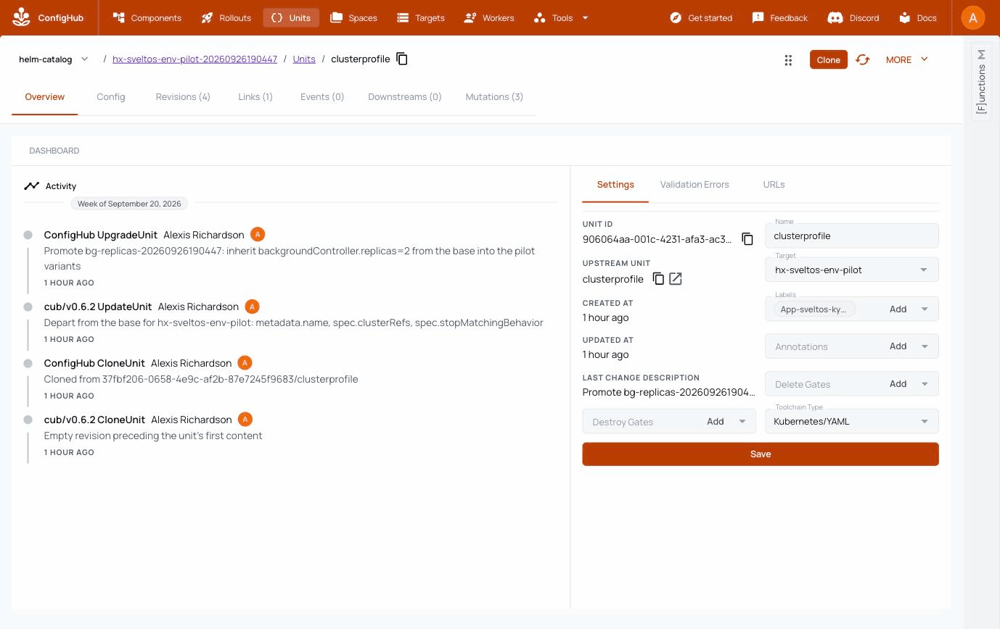

# Sveltos on ConfigHub

If you run more than a handful of Kubernetes clusters and want every change
to them reviewed, approved, and answerable afterwards, this repository is a
working, recorded example of exactly that.

It joins two tools. [ConfigHub](https://confighub.com) is a configuration
database: governed records with revision history and approval gates, where a
fleet is one shared base plus per-cluster variants, clones of that base
carrying only their declared differences. [Sveltos](https://projectsveltos.io)
is an open-source Kubernetes add-on controller: it runs on one management
cluster, delivers to the others, and keeps them converged, repairing drift
without being asked. The join is short: every approved revision is published
as an OCI image on ConfigHub's gateway, and Sveltos fetches that image and
delivers it to the one cluster its record addresses.

Sixty seconds to watch it check itself, with no account, no cluster, and no
network:

```bash
git clone https://github.com/confighub/sveltos-confighub
cd sveltos-confighub
npm run verify
```

**Already running Sveltos?** Point the onboarding plan at what your
management cluster already knows. With no account and no cluster, it shows
the fleet ConfigHub would govern: each profile's charts rendered to the
Kubernetes objects they install, held once as a base, and one variant per
cluster the profile selects today, holding exactly the objects that cluster
runs.

```bash
cub plugin install confighub/sveltos-confighub
cub plugin install confighub/cub-helm
kubectl get clusterprofiles,sveltosclusters -A -o yaml > my-fleet.yaml
cub sveltos plan my-fleet.yaml --stage-label env --stages staging,prod
```



[Onboard your Sveltos fleet](docs/user/onboard-your-sveltos-fleet.md) takes it
from there: one more command writes the steps as a script to read and run,
live profiles hand over to one delivery profile per cluster without
reinstalling anything, and Kyverno policies come with them. From then on a
change, a chart upgrade included, is a reviewed change to the objects,
released stage by stage.

This is the fleet companion to
[kubara-confighub](https://github.com/confighub/kubara-confighub), which
governs a platform one cluster at a time. This repository governs one change
across many clusters.

## What the delivery path is

1. Config comes from ConfigHub, where a reviewed record is stored, checked,
   and held until someone approves it.
2. A named person approves one exact revision, and ConfigHub publishes it as
   an OCI image on its OCI gateway. In chapter three the approval is an
   attestation, `cub variant approve`, and ConfigHub refuses the release
   until it is recorded.
3. Sveltos on the management cluster fetches that image and sends the
   reviewed profile to the one cluster its clusterRefs entry names.
4. Sveltos keeps that cluster aligned and repairs drift.

Each cluster's lane runs the whole way on its own variant, its own approval,
its own gateway address, and its own digest. Sveltos on the management
cluster is the carrier for every lane:


```mermaid
flowchart LR
  b["base"] -->|"change made once"| p["pilot variant"]
  b --> s["staging variant"]
  b --> pa["prod-a variant"]
  b --> pb["prod-b variant"]
  p -->|"approve, publish"| gp["gateway address"] -->|"Sveltos fetches"| cp["pilot cluster"]
  s --> gs["gateway address"] --> cs["staging cluster"]
  pa --> ga["gateway address"] --> ca["prod-a cluster"]
  pb --> gb["gateway address"] --> cb["prod-b cluster"]
```

No GitOps controller and no intermediate registry take part. Promotion does
not change the delivery wiring at all: publishing the approved release moves
the tag, and the fleet follows, so approval alone moves the fleet.

## Why we did this

Fleet tools can move configuration to many clusters. The harder question is
what reached them and who agreed to it. Three answers here are unusual
enough to be the point of the repository.

- **One variant per cluster.** Sveltos lets one profile reach many
  clusters, which is how it scales. This repository narrows that on purpose:
  every cluster, the management cluster included, has its own variant in
  ConfigHub, and that variant names its one cluster in a single
  `clusterRefs` entry, so it cannot reach a second cluster by accident. That
  is what lets you approve a change for one cluster while holding another,
  roll back one cluster alone, and say which revision each cluster runs
  today. The variants share a base and hold only their differences, so a
  change made once on the base still reaches all of them. Each variant ships
  to a Target named for its cluster, so where it ships is recorded in
  ConfigHub, not in a label selector inside the YAML.
- **The rollout order is reviewed configuration too.** A wave is a query
  over the variants' labels, such as staging or prod, not a separate
  pipeline, and widening a rollout means approving the next cluster's
  variant. In chapter three each wave is a stage of a reviewed ChangeWorkflow,
  and ConfigHub refuses to promote a change into a stage until the stage
  ahead has released it.
- **Approval binds to an exact revision.** It is not a sync button and not a
  paused bundle. Approving yesterday's revision authorises nothing about
  today's, and the bytes that shipped are the bytes that were approved.
  ConfigHub now records an approval as an attestation on exact revisions and
  lets a ChangeWorkflow require it before a release is published; the
  recorded chapters used the earlier trigger-based gate, which ConfigHub
  removed on 2026-09-25.
- **The matrix keeps four facts apart** that a status page usually collapses
  into one green tick: which revision each cluster should run, which release
  was published, what the controller fetched, and what Kubernetes reports.

## See the result first

Three ConfigHub words appear below. A **Space** holds one variant or the
base, a **Target** is a named destination (one per cluster), and a
**component** groups a base with its variants. The
[onboarding guide](docs/user/onboard-your-sveltos-fleet.md#the-words-you-will-meet)
defines the rest in a few lines.

This is the recorded chapter-three fleet as ConfigHub shows it: one base
on the left, one variant per cluster on the right, and every deployment
card headed by its own named Target — the cluster it ships to is
ConfigHub's own destination model, not a selector line inside the YAML.
Each variant sits at its second release: the first carried its reviewed
baseline, the second the one reviewed change to the base. The base is the
dashed node with no Target at all, because the base ships nowhere, and the
management record lives in a component of its own, so it is not drawn here:



The "Not reported yet" chips are the honest part: ConfigHub publishes and
never connects to the clusters, so live state is not its claim to make.
Sveltos knows the answer per cluster, and teaching ConfigHub to show
Sveltos's reading in Sveltos's own words is proposed upstream.

The change itself, as ConfigHub's Rollouts view shows it. One change order
carries the one reviewed edit on the base, `backgroundController.replicas`
from 1 to 2, and moved it through the workflow's stages: pilot, then
staging, then both production clusters, each stage entered only after the
stage ahead had released the change, and each stage's releases published
only after the change was approved there. "Complete, unverified" is honest
too: every stage has taken the change, and the workflow declares no health
check yet, because nothing reports Sveltos's view to ConfigHub:



One variant up close, the pilot cluster's, with the whole story in its
activity: cloned from the base, departed in exactly three fields (its name,
the clusterRefs entry that names its cluster, its removal behaviour), then
taking the reviewed base change when the change order was promoted into the
pilot stage. Its Target is named for its cluster. The approval is an
attestation on that variant's exact revision, which
`cub attestation list --space <space>` shows; this page does not show
attestations yet:



Chapter four is fleet patch day with evidence: the patched chart's
provenance was checked against the reviewed digest before anything was
stored, the bump moved through all three environments, and a
[coverage audit](data/sveltos-cve-patch/matrix.md) named every cluster and
confirmed each runs the patched version.

Chapter five wrote one reviewed edit into every variant in a single pass
and closed with a [zero-drift audit](data/sveltos-bulk-ops/matrix.md) that
names the management record's armed schema-vet gate as the recorded
bootstrap boundary. Its receipt records the shape of that fan-out
honestly: one reviewed edit, four variant updates, four approvals, and
four release publishes, because each Space publishes its own release.

Chapter three governs one variant per cluster over a shared base, so
ConfigHub answers which cluster runs which revision from its own records
rather than from a label query Sveltos resolves at delivery time, and it
promotes its waves through a ConfigHub ChangeWorkflow. Its committed
[receipt](runs/sveltos-env-rollout-proof/receipt.yaml), recorded live on
2026-09-26 on the released Sveltos v1.15.0, shows each wave as a stage: one
ChangeOrder captured the reviewed edit on the base,
`cub variant promote --change-order` moved exactly that change into the
variants a stage selects, and ConfigHub enforced the `Released` gate on the
server. Before wave one the runner asked ConfigHub to skip straight into
staging, and the receipt carries the server's refusal in its own words.

Approval is an attestation. On 2026-09-25 ConfigHub removed the
trigger-based approval gate the earlier recordings used
(confighubai/confighub#5495), so every stage of chapter three's reviewed
[workflow](examples/sveltos/env-rollout/change-workflow.yaml) requires one
Approval attestation before a release of the change is published into it.
Each wave attempted the release first, and ConfigHub refused it with HTTP
422 ("requires approval … has 0 of 1"); the runner recorded that refusal,
approved the change in the stage with
`cub variant approve --change-order <base-space>/<change-order> --stage <stage>`,
and published. The baseline went through a change order of its own that
carries no change, so every release that reached a cluster passed the same
gate. The run is single-operator, and ConfigHub does not by default count
an approval from whoever promoted the change, so the workflow sets
`AllowAuthors: true` and the receipt says plainly that the demo relaxes
separation of duties; a production workflow keeps the default and has a
second approver. The `Healthy` gate waits for a Sveltos status reporter
([#33](https://github.com/confighub/sveltos-confighub/issues/33)) and for
ConfigHub to recognise the provider (confighubai/confighub#5049), so the
runner's checkpoint evidence is the observed-health layer: every cell of the
[per-cluster matrix](data/sveltos-env-rollout/matrix.md), four clusters at
four checkpoints, is an observed pass from that receipt.

Chapter six continues that same recorded fleet and makes the opposite move.
One production cluster was restored to its exact pre-advance revision, the
approval gate armed on the restored head like on any other revision, and
the publish was refused until the restore itself was approved. A further
reviewed advance then moved three clusters forward while the restored
cluster was held by not approving its pending revision. The
[held-cluster matrix](data/sveltos-held-cluster/matrix.md) shows the fleet
at three points on purpose, and every observed cell comes from the
committed [receipt](runs/sveltos-held-cluster-proof/receipt.yaml): three
clusters advanced, one held at the restored revision with its approval
deliberately absent.

Chapters one and two hold the same shape, and the
[recorded canary](data/sveltos-oci-delivery-proof/summary.md) shows what it
buys: two records, two approvals, two release digests. Wave one approved and
delivered the pilot cluster's variant alone while the second cluster's
variant sat complete, addressed, and gate-armed with zero approvals and
nothing served for its Space — the
[receipt](runs/sveltos-oci-delivery-proof/receipt.yaml) records that held
state as evidence, wave two's approval was unlocked by the checkpoint that
showed the pilot healthy, and injected drift was repaired on both clusters.
No selector was edited anywhere.

The [fleet rehearsal](examples/sveltos/fleet-rehearsal/README.md) proves the
delivery machinery on a five-cluster fleet with no ConfigHub account at all,
and records its phase timings.

## The six chapters

1. **[Kyverno across the fleet](examples/sveltos/kyverno-fleet/README.md)**
   installs admission policy through one reviewed variant per cluster, each
   behind the approval gate, because policy is the clearest case for review
   before a change reaches any cluster. Recorded live on the gateway; the
   first, partial recording remains a historical result.
2. **The canary**, in the same example: the pilot cluster's variant approved
   and delivered first, the second cluster's variant complete, addressed,
   and gate-armed until its own approval widens the rollout. No selector is
   edited anywhere. Recorded live on the gateway.
3. **[Environment rollout](examples/sveltos/env-rollout/README.md)** promotes
   one reviewed values change pilot to staging to production, with one
   governed variant per cluster and no variant addressing two clusters.
   Each wave is a ConfigHub ChangeWorkflow stage whose releases wait for an
   Approval attestation. Recorded live on the gateway on the released
   Sveltos v1.15.0.
4. **[CVE patching](examples/sveltos/cve-patch/README.md)**: one reviewed
   version bump with digest-bound provenance, closed by a coverage audit
   that proves no cluster was missed. No vulnerability scanning is claimed.
   Recorded live on the per-cluster design.
5. **[Bulk operations](examples/sveltos/bulk-ops/README.md)**: one reviewed
   edit written to every record in one pass, closed by a zero-drift audit.
   Recorded live on the per-cluster design, closing with the zero-drift
   audit naming the management record's armed schema-vet gate as the
   recorded bootstrap boundary.
6. **[The held cluster](examples/sveltos/held-cluster/README.md)**: one
   production cluster restored to an exact earlier revision under the same
   approval gate, then held on purpose through the next fleet advance while
   its twin moves forward. The restore is a revision like any other; the
   hold is the absence of an approval. Recorded live on the gateway.

All six chapters are recorded live on the per-cluster design over the
gateway: each cluster with its own governed variant, its own named Target,
and its own clusterRefs address, every wave's approval carrying the
checkpoint evidence that unlocked it, and every observed matrix cell
coming from a committed receipt. Every receipt that builds a fleet records
the addon controller image its run used; chapter six builds nothing and
names the recorded cohort that does.

Chapter three is recorded on ChangeWorkflows and attestations. The
recordings of chapters one, two, four, five, and six approved through the
trigger-based gate ConfigHub removed on 2026-09-25, and they stay valid as
records of what happened. Their live lanes are still written against that
gate, so each now stops before building anything and says why; they move to
attestations next
([#34](https://github.com/confighub/sveltos-confighub/issues/34)). Their
offline self-tests keep walking the old path against their own fakes.

**Chapter seven, [the GPU operator on exactly the clusters approved for it](examples/gpu-operator/README.md),**
starts where GPU fleets are today: NVIDIA's operator on every cluster
labelled `addons.gpu-operator: enabled`. It onboards that fleet with
`cub sveltos`, enables the operator on one more cluster by approval rather
than by label, shows a mislabel shipping nothing, and upgrades operator and
driver on staging before prod, using NVIDIA's own AI Cluster Runtime recipe.
ConfigHub holds the operator as the objects its chart renders to, so the
driver version a reviewer approves is the ClusterPolicy's
`spec.driver.version`, a field of its own. It is recorded on kind as a run
log rather than a receipt, and kind has no GPUs, so it proves the governance
and delivery, not a driver coming up.

**[A slice of Meridian](examples/meridian-slice/README.md)**, ConfigHub's
demo fleet, delivered for real by Sveltos: four of its eu-central clusters
and its Kyverno component in Meridian's three levels (a root base, a class
base per class, a deployment per cluster), made by `cub sveltos
--class-label` from one Sveltos profile per class. Each class base holds
what its class's values render differently: the admission controller's
replicas, protected, and a PodDisruptionBudget above one replica. One chart
upgrade and one replica change on the root reached the class bases, then
test, uat and prod in order, and uat and prod kept their own replicas.
Recorded on kind as a run log.

## How to run it

Already running Sveltos? [Onboard your Sveltos fleet](docs/user/onboard-your-sveltos-fleet.md)
turns the ClusterProfiles you have into this shape with three commands.

To stand this shape up for your own fleet, at any size, read
[Run your own fleet on one variant per cluster](docs/user/run-your-own-fleet.md):
the shape, what a change costs at N clusters, adding and removing a cluster,
and the operational limits this repository already measured.

Every check runs with no account, no cluster, and no network, and the
repository has no npm dependencies:

```bash
git clone https://github.com/confighub/sveltos-confighub
cd sveltos-confighub
npm run verify
```

The fleet rehearsal builds its own clusters and needs no ConfigHub account:

```bash
HELM_EXPT_ALLOW_LIVE_SVELTOS_REHEARSAL=1 npm run sveltos-fleet-rehearsal:run
```

The governed chapters need the `cub` CLI and one authenticated context.
Install it with `curl -fsSL https://hub.confighub.com/cub/install.sh | bash`,
then `cub auth login`; a cub from before attestations cannot run chapter
three, and the runner says so. Confirm what the run gates on before building
a fleet. The probe checks that the platform trigger filter resolves its
validating triggers and no approval trigger, creates the reviewed workflow
in a throwaway Space, reads its approval requirement back, and removes the
Space:

```bash
CUB_CONTEXT=my-policy npm run sveltos-gate:probe
```

Then record chapter three. It runs the released Sveltos v1.15.0 as
published, so it takes no controller image override and refuses one:

```bash
HELM_EXPT_ALLOW_LIVE_SVELTOS_ENV_ROLLOUT=1 \
CUB_CONTEXT=my-policy \
npm run sveltos-env-rollout-proof:run
```

The recorded runs used the maintainers' catalog organization, which owns the
policy Space and trigger filter the runners check for. In another
organization, create that wiring first from
[the committed policy](config-catalog/policies/catalog-standard.yaml), leaving
out its require-approval trigger, whose function ConfigHub no longer has.
Each runner checks its preconditions and stops early with a named reason
instead of failing after the fleet build. Fleet proofs run serially, never in
parallel.

Reading a release from the ConfigHub gateway needs an addon controller that
decompresses gzipped layers. That fix shipped in Sveltos v1.14.0, and
chapter three is recorded on the released **Sveltos v1.15.0**
([lock](examples/sveltos/env-rollout/source-lock.yaml)) with its stock
`projectsveltos/addon-controller:v1.15.0` and no override. The other
chapters' recordings ran **Sveltos v1.13.0** with
`projectsveltos/addon-controller:v1.13.0-ch`, a build carrying the fix
before it shipped, which the
[gateway probe](docs/planning/remote-url-oci-probe.md) measured; they name
that build until they re-record on a release, and every receipt records the
image its run used.

Requirements: node 22 or newer, python3 with pyyaml, and tar. The live lanes
additionally use cub, docker, kind, kubectl, helm, curl, and oras.

## What this does not claim

It does not claim a cumulative failure budget, an automated verification
step between stages, a timeout on a stalled wave, or a single action that
halts and reverses a rollout across the fleet. Rollback here restores one
target to an exact revision, which is a different thing.

## Provenance

This work was extracted from
[confighub/helm-expt](https://github.com/confighub/helm-expt) with paths
preserved, so every committed receipt verifies here unchanged. The planning
brief is [docs/planning/sveltos-fleet-brief.md](docs/planning/sveltos-fleet-brief.md)
and the one-page story is
[docs/demo/sveltos/fleet-chapters.md](docs/demo/sveltos/fleet-chapters.md).
