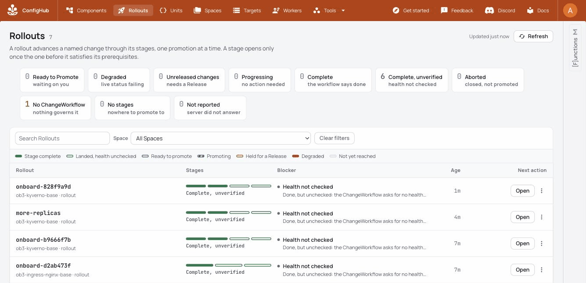
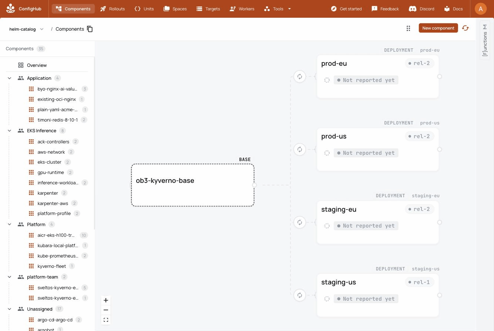

# Onboard your Sveltos fleet

You already describe your fleet in Sveltos's own terms: ClusterProfiles that
pick clusters by label, and the SveltosClusters they pick from. This guide
turns that into a governed fleet in ConfigHub with three commands, and the
first two change nothing.

You need the `cub` CLI logged in to your ConfigHub organization
(`cub auth login`), `kubectl` access to your management cluster, which must
run Sveltos v1.14.0 or newer, and the plugin:

```bash
cub plugin install confighub/sveltos-confighub
```

## The words you will meet

- **Base**: your ClusterProfile with its selector removed, stored once in
  ConfigHub. It reaches no cluster; a change to the fleet is made here.
- **Variant**: a copy of the base for one cluster. It names that cluster in
  `clusterRefs` and inherits every later change to the base.
- **Departure**: a field in which a variant differs from its base. Here that
  is its name and its `clusterRefs` entry, nothing else.
- **Space**: ConfigHub's folder for configuration. The base and each variant
  get one; your organization has a quota of them.
- **Component**: the group of one base and its variants. There is one per
  profile.
- **Target**: a named destination, one per cluster. A variant's releases go
  to its cluster's Target, where Sveltos fetches them.
- **Link**: what ties a variant to its base so changes flow down; one per
  variant, also under a quota.
- **Change order**: one change moving through the stages, pilot to prod, with
  an approval recorded in each stage before its release. **Workflow**: the
  stages and what each waits for.

## 1. Export what Sveltos knows

On your management cluster:

```bash
kubectl get clusterprofiles,sveltosclusters -A -o yaml > my-fleet.yaml
```

A file you wrote by hand works too; [my-fleet.yaml](../../examples/onboard/my-fleet.yaml)
is an example with two profiles and five clusters.

## 2. See the plan

```bash
cub sveltos plan my-fleet.yaml --stage-label env --stages staging,prod
```

The plan runs offline, with no account, and shows what ConfigHub would hold:

```text
kyverno  (selects env In [staging, prod])
  base     sveltos-kyverno-base  reaches no cluster: clusterRefs is empty
  stage staging
    staging-eu   variant sveltos-kyverno-staging-eu  ->  Target sveltos-targets/staging-eu
                 differs from the base in metadata.name, spec.clusterRefs
  stage prod
    prod-eu      variant sveltos-kyverno-prod-eu  ->  Target sveltos-targets/prod-eu
                 differs from the base in metadata.name, spec.clusterRefs
    prod-us      variant sveltos-kyverno-prod-us  ->  Target sveltos-targets/prod-us
                 differs from the base in metadata.name, spec.clusterRefs
```

Each profile becomes a **base**: your profile with its selector removed, so
it reaches no cluster on its own. Each cluster the profile selects today gets
a **variant**: a copy of the base that names that one cluster in
`clusterRefs`, and nothing else. Your labels chose the clusters, and
`--stage-label` turns them into the order a change rolls out in. The
[full plan for the example](../../examples/onboard/plan.txt) also lists what
is left out and why, and what the first rollout needs.

Leave out the stage options and every cluster is in one stage, `fleet`.

## 3. Write the steps, read them, run them

```bash
cub sveltos apply my-fleet.yaml --stage-label env --stages staging,prod --out onboard
MGMT_CONTEXT=<kubectl context of your management cluster> bash onboard/apply.sh
```

`apply` writes the files and one script, and runs nothing. The script for
the example is [committed](../../examples/onboard/apply/apply.sh), so you can
read exactly what yours will do. It checks first that `cub` is logged in and
that your management cluster runs Sveltos v1.14.0 or newer (earlier releases
cannot read the gzipped layers ConfigHub's gateway serves), then:

1. Creates one Target per cluster, named for it, on a server-hosted worker.
2. Stores each base and the workflow its changes follow.
3. Creates each cluster's variant with its departures, bound to its Target.
4. Stores the management cluster's record: one bootstrap profile per variant.
5. Rolls out the first release stage by stage: promote, approve, publish.
6. On your management cluster, adds the gateway Secret and the bootstrap
   profiles. From then on Sveltos fetches each variant's latest release
   itself, within a minute of it being published.

The whole script is safe to re-run. It picks up where ConfigHub says each
step stands, and it never writes over a change made in ConfigHub since.

Sveltos reads the gateway as the Targets' server worker. That credential does
not expire, it can pull only the releases of those Targets, and the script
moves it from `cub` into the Secret without writing it to disk or showing it.

## What you will see

ConfigHub's Rollouts view shows each release moving through its stages. In
the rehearsal below, the first release of each profile, a later change, and
a cluster joining are one row each:



Each profile is a component: its base, and one variant per cluster, each
headed by the Target named for it. The cluster that joined last is at its
first release, the others at their second:



Every command in this guide was rehearsed end to end on kind clusters running
stock Sveltos v1.15.0; the [rehearsal record](../planning/onboarding-rehearsal.md)
says what was measured.

## If your profiles are live

If you exported from a live management cluster, the plan says which profiles
are live, and `apply` also writes `takeover.sh`. Run it after `apply.sh`:

```bash
MGMT_CONTEXT=<kubectl context of your management cluster> bash onboard/takeover.sh
```

Until then nothing changes on your clusters. Each variant's profile deploys
the same add-on to the same cluster as your live profile, and Sveltos lets
one profile manage a release at a time, so the new profiles arrive and wait,
reporting `cannot manage chart ... ClusterSummary ... managing it`.
`takeover.sh` sets each live profile to `stopMatchingBehavior: LeavePolicies`,
so deleting it leaves its add-ons in place, and then deletes it. Each
per-cluster profile then takes over the release it was waiting for.

Measured on kind with stock Sveltos v1.15.0, for Helm charts and for plain
resources deployed through `policyRefs`: the per-cluster profiles took over
within a minute, every Helm release stayed at the revision it had, every pod
and every deployed object kept its identity, and nothing was reinstalled or
recreated. Do not delete a live profile without `LeavePolicies`: by default
Sveltos withdraws what it deployed, and the add-on would be uninstalled
before its variant reinstalled it. Kustomize profiles follow the same order
but have not been measured; check `kubectl get clustersummaries -A` after
`takeover.sh`.

A profile that deploys through `policyRefs` names ConfigMaps or Secrets on
your management cluster. ConfigHub governs the profile, including which of
them it names; the ConfigMaps and Secrets themselves stay where they are.

## Making a change afterwards

ConfigHub now holds each profile's base, so a change starts there. It is made
once, on the base, and moves through the stages with an approval in each:

```bash
cub unit data --space sveltos-kyverno-base clusterprofile > kyverno-base.yaml
# edit kyverno-base.yaml, then store it on the base
cub unit update --space sveltos-kyverno-base clusterprofile kyverno-base.yaml \
  --change-desc "Raise the admission controller to 4 replicas"
cub changeorder create --space sveltos-kyverno-base more-replicas \
  --change-workflow sveltos-kyverno-base/rollout --description "Raise replicas"

cub variant promote --change-order sveltos-kyverno-base/more-replicas --target-stage staging
cub variant approve --change-order sveltos-kyverno-base/more-replicas --stage staging
cub release publish sveltos-kyverno-staging-eu --revision ChangeOrder:sveltos-kyverno-base/more-replicas

cub variant promote --change-order sveltos-kyverno-base/more-replicas --target-stage prod
cub variant approve --change-order sveltos-kyverno-base/more-replicas --stage prod
cub release publish sveltos-kyverno-prod-eu --revision ChangeOrder:sveltos-kyverno-base/more-replicas
cub release publish sveltos-kyverno-prod-us --revision ChangeOrder:sveltos-kyverno-base/more-replicas
```

ConfigHub refuses to promote into prod until staging has released the
change, and refuses each release until the change is approved in its stage;
both refusals come from the server, in its own words. ConfigHub's Rollouts
view shows where the change stands. Keep the base in YAML: ConfigHub lines
each variant up with its base by the stored document, and a base rewritten as
JSON no longer lines up, so later changes stop reaching the variants.

The generated workflow lets the person who promotes a change also approve
it, which one person trying this needs. Once a second person approves, set
`AllowAuthors: false` in each profile's `change-workflow.yaml`, and ConfigHub
refuses an approval from the change's author.

## When a cluster joins

Register the cluster with Sveltos and label it as you always have. Nothing
ships to it yet: a label no longer deploys anything by itself. Then plan and
apply again, with the profiles `apply` saved and a fresh cluster list:

```bash
kubectl get sveltosclusters -A -o yaml > clusters.yaml
cub sveltos plan onboard/profiles.yaml clusters.yaml --stage-label env --stages staging,prod
cub sveltos apply onboard/profiles.yaml clusters.yaml --stage-label env --stages staging,prod --out onboard
MGMT_CONTEXT=<kubectl context of your management cluster> bash onboard/apply.sh
```

The plan shows the new cluster's variants. The script leaves every existing
variant as it is, clones the new one from the base as the base stands today,
including every change made since onboarding, and releases it through its
stages with an approval in each. So joining the fleet is one reviewed change
rather than a side effect of a label. A watcher that proposes the variant as
soon as a cluster registers is
[#41](https://github.com/confighub/sveltos-confighub/issues/41).

If you keep one Git repository per cluster, you already have the variants;
what they lack is inheritance. Here the shared fix is made once, on the base,
and every variant takes it while keeping its own departures.

## What this first version leaves alone

- Namespaced `Profile` objects; it onboards `ClusterProfile`s.
- Profiles that select through ClusterSets, which choose clusters at
  delivery time.
- Profiles that select no cluster today.
- Clusters no profile selects; the plan lists them.

Cluster API clusters are addressed as their `Cluster`, the same structural
way; that path has not been rehearsed live yet.
