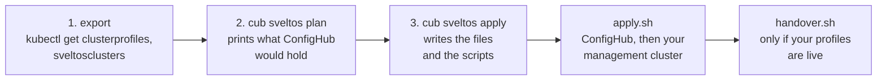
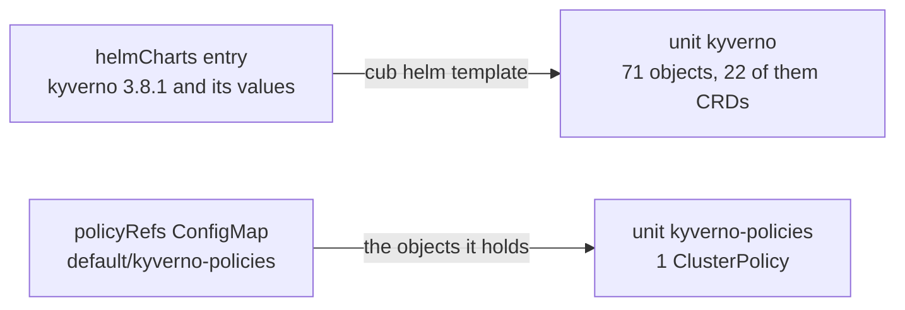
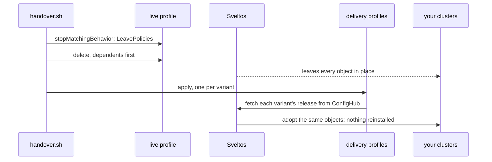
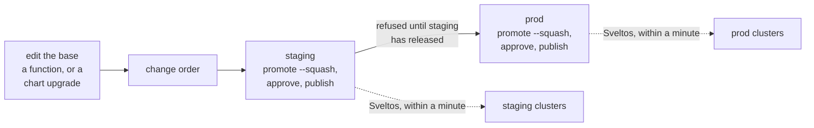
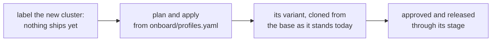

# Onboard your Sveltos fleet

You already describe your fleet in Sveltos's own terms: ClusterProfiles that
pick clusters by label and install Helm charts or policies, and the
SveltosClusters they pick from. This guide turns that into a fleet ConfigHub
governs, with three commands, and the first two change nothing.

What changes is where the truth lives. ConfigHub holds, for each cluster, the
Kubernetes objects that cluster runs: each chart rendered with its values,
each policy as the object it is. Every change is a reviewed change to those
objects, released stage by stage. Sveltos keeps doing what it does well: it
delivers each cluster's release to that cluster and repairs drift.
`cub sveltos` is how you get there; after onboarding, every change is made
with ConfigHub's own commands.


A change is made once, on the base, and reaches each variant through the
stages. Each delivery profile names one cluster (`clusterRefs`) and reads one
variant's latest approved release from ConfigHub's OCI gateway. If your
profiles are live, the handover moves them over in the numbered order, with
nothing reinstalled.

You need the `cub` CLI logged in to your ConfigHub organization
(`cub auth login`), `kubectl` access to your management cluster, which must
run Sveltos v1.14.0 or newer, and two plugins:

```bash
cub plugin install confighub/sveltos-confighub
cub plugin install confighub/cub-helm
```

`cub sveltos` renders charts with `cub helm template`, ConfigHub's own Helm
renderer, so a chart onboarded here holds the objects `cub helm` would.

## The words you will meet

- **Base**: what a profile's charts and policies render to, stored once. It
  reaches no cluster. A change for every cluster is made here.
- **Variant**: a copy of the base for one cluster, holding the objects that
  cluster runs. It takes every later change to the base.
- **Class base**: with `--class-label`, a level between the base and the
  clusters, one per class (test, uat, prod; or h100, rtx-pro-6000), holding
  what that class differs in.
- **Delivery profile**: one ClusterProfile per variant on your management
  cluster, addressed to that cluster alone, that fetches the variant's
  latest release from ConfigHub.
- **Space**: ConfigHub's folder for configuration. Each base, class base and
  variant gets one; your organization has a quota of them.
- **Component**: one base with its class bases and variants. There is one
  per profile, or one per set of class profiles.
- **Target**: a named destination, one per cluster. A variant's releases go
  to its cluster's Target.
- **Link**: what ties a unit to the one it takes changes from; also under a
  quota.
- **Change order**: one change moving through the stages, test to prod, with
  an approval recorded in each stage before its release. **Workflow**: the
  stages and what each waits for.

## The journey



The first three steps change nothing anywhere: `plan` needs no account and no
cluster, and `apply` only writes files. You read `apply.sh` before you run it.

## 1. Export what Sveltos knows

On your management cluster:

```bash
kubectl get clusterprofiles,sveltosclusters -A -o yaml > my-fleet.yaml
```

A file you wrote by hand works too; [my-fleet.yaml](../../examples/onboard/my-fleet.yaml)
is an example with three profiles and five clusters. If a profile names
ConfigMaps in `policyRefs`, the plan asks for them too.

## 2. See the plan

```bash
kubectl get configmap -n default kyverno-policies -o yaml > kyverno-policies.yaml
cub sveltos plan my-fleet.yaml kyverno-policies.yaml \
  --stage-label env --stages staging,prod --include-hooks ingress-nginx
```

The plan renders each chart, needs no account and no cluster, and shows what
ConfigHub would hold:

```text
kyverno  (selects env In [staging, prod])
  base     sveltos-kyverno-base  holds what its charts and policies render to, and delivers to no cluster:
    unit   kyverno  chart kyverno 3.8.1 from https://kyverno.github.io/kyverno: 71 objects (22 CRDs)
  stage staging
    staging-eu   variant sveltos-kyverno-staging-eu  ->  Target sveltos-targets/staging-eu
  stage prod
    prod-eu      variant sveltos-kyverno-prod-eu  ->  Target sveltos-targets/prod-eu
    prod-us      variant sveltos-kyverno-prod-us  ->  Target sveltos-targets/prod-us
```



Each chart becomes one unit holding the objects `cub helm template`
renders, in the order it prints them. Your labels chose the clusters, and
`--stage-label` turns them into the order a change rolls out in; leave it
out and every cluster is in one stage, `fleet`. The [full plan for the example](../../examples/onboard/plan.txt)
also lists what is left out and why, and how many Spaces and Links the fleet
needs: check your organization's quotas for both first.

**Helm hooks.** Only Helm runs hooks, so rendered objects leave them out, as
`cub helm` does. A chart whose hooks run when it installs, such as
ingress-nginx's jobs that make its webhook certificate, is a problem in the
plan until you pass `--include-hooks <release>`. That keeps its hooks, exactly
as `cub helm template --include-hooks` prints them, and its delivery profiles
mark them the way Sveltos treats hooks when it runs Helm: annotated
`projectsveltos.io/driftDetectionIgnore`, so they are not watched for drift.
Measured on kind with a hook Job that deletes itself when it finishes, as
ingress-nginx's do: without the mark, Sveltos recreated it ten times in a
minute and a half; with it, the Job ran once, stayed gone, and ran once more
with the next release, as a Helm upgrade runs it. A chart with hooks for
delete or test cannot be kept this way, since they would run at install too;
the plan says so.

## 3. Write the steps, read them, run them

```bash
cub sveltos apply my-fleet.yaml kyverno-policies.yaml \
  --stage-label env --stages staging,prod --include-hooks ingress-nginx --out onboard
MGMT_CONTEXT=<kubectl context of your management cluster> bash onboard/apply.sh
```

`apply` writes the files, the rendered objects among them, and one script,
and runs nothing. The script for the example is
[committed](../../examples/onboard/apply/apply.sh), so you can read exactly
what yours will do. It checks first that `cub` is logged in and that your
management cluster runs Sveltos v1.14.0 or newer (earlier releases cannot
read the gzipped layers ConfigHub's gateway serves), then:

1. Creates one Target per cluster, named for it, on a server-hosted worker.
2. Stores each base, and the workflow its changes follow. Above each chart
   it notes the `cub helm template` command the chart was rendered with,
   and `apply` writes the chart's values beside it, so the next version can
   be rendered the same way.
3. Creates each class base with what its class differs in, and each
   cluster's variant, bound to its Target. A variant is checked to hold every
   unit of its base.
4. Stores the management cluster's record: one delivery profile per variant.
5. Rolls out the first release stage by stage: promote, approve, publish.
   A variant missing a unit is never released: Sveltos would remove from its
   cluster whatever the release no longer holds.
6. On your management cluster, adds the gateway Secret and the delivery
   profiles. From then on Sveltos delivers each variant's latest release to
   its cluster, within a minute of it being published, and puts back
   anything changed by hand.


The whole script is safe to re-run. It picks up where ConfigHub says each
step stands, and it never writes over a change made in ConfigHub since.

Sveltos reads the gateway as the Targets' server worker. That credential does
not expire, it can pull only the releases of those Targets, and the script
moves it from `cub` into the Secret without writing it to disk or showing it.

## If your profiles are live

If you exported from a live management cluster, the plan says which profiles
are live, and `apply` also writes `handover.sh`. `apply.sh` then leaves those
profiles' delivery profiles for `handover.sh`. Run it after `apply.sh`:

```bash
MGMT_CONTEXT=<kubectl context of your management cluster> bash onboard/handover.sh
```

Before it changes anything, `handover.sh` checks that what was planned is
still what is live:
- each live profile is the one you exported, unchanged since (its uid and
  generation);
- it still reaches the clusters planned;
- each ConfigMap of policies is unchanged.

If one has moved on since the export, say a chart was upgraded in the
profile or a cluster was labelled, ConfigHub no longer holds what runs, and
the delivery profiles would change the clusters to match an older plan. So
it stops, before touching anything, and asks you to export, plan and apply
again. A run that stopped half-way can simply be run again.

Then, for each live chart on each cluster, it compares what ConfigHub
released for that cluster's variant with the manifest Helm recorded when
Sveltos installed the chart there. It reads Helm's record through the
cluster's kubeconfig Secret on the management cluster, the way Sveltos
reaches the cluster. The two match when the chart rendered the same for
ConfigHub as it did on the cluster. They differ when the chart branches on
the cluster's Kubernetes version or APIs, or reads the cluster with
`lookup`. Then the handover would change the cluster, so the script stops
and names each difference, for example:

```text
eu-central-prod1 kyverno: ConfigHub releases something other than what Helm installed, so the handover would change the cluster:
  - Deployment kyverno/kyverno-admission-controller: spec.replicas is 3 on the cluster, 1 stored
```

Find out why first. To hand over anyway, and let the delivery profiles make
those changes, run it with `ACCEPT_DIFFERENCES=yes`.

- **A cluster at an address only the management cluster can reach**, as with
  kind or many Cluster API setups: put a kubeconfig that reaches it from where
  you run the script at `<dir>/<cluster>.kubeconfig`, and set
  `CLUSTER_KUBECONFIGS=<dir>`. The script does not skip a cluster it cannot
  reach.
- **A cluster in pull mode**, which the management cluster cannot read, is
  named as not compared.

Measured on kind, against a chart Sveltos installed through Helm:
- the same values compared the same;
- a changed replica count was named, and so was a changed chart version.

Until then your live profiles keep managing everything. `handover.sh` sets
each live profile to `stopMatchingBehavior: LeavePolicies`, so deleting it
leaves everything in place, and deletes it; a profile another live profile
depends on goes after it, since Sveltos holds its deletion until the
dependent is gone. Then it applies the delivery profiles, which adopt what
is there. No object ever has two profiles managing it. Do not delete a live
profile without `LeavePolicies`: by default Sveltos withdraws what it
deployed.



Measured on kind: every long-running pod and the Kyverno policy kept its
identity, and each Helm release stayed at the revision it had. In an earlier
run, with the delivery profiles applied while the live ones still ran, a
live profile with drift detection took their first write as drift and ran
one more `helm upgrade`, hooks and all, and `policyRefs` objects sat in
conflict; that is why the live profiles now leave first.

Helm still records each release it installed, though ConfigHub manages the
objects now, and a `helm uninstall` would remove them. `handover.sh` prints
the command that removes the record on each cluster and leaves the objects.

If a live profile is itself applied from somewhere else, by Flux, Argo CD
or Helm, the plan says so, from the labels those tools leave, and
`handover.sh` stops while the profile is still there: deleting it would only
see it applied again, competing with its delivery profiles. Hand it over
where it comes from instead:
1. Set `stopMatchingBehavior: LeavePolicies` on it there, and let that apply.
2. Remove it there. That deletes it, and leaves everything it deployed in
   place.
3. Run `handover.sh`. It finds the profile gone and applies its delivery
   profiles.

Removing it without step 1 would withdraw its add-ons from every cluster.

## Kyverno policies, and other `policyRefs`

A ConfigMap a profile names in `policyRefs` holds the objects Sveltos
deploys; for Kyverno, the policies themselves. The base holds those objects,
so a policy is reviewed and staged like any other change, and each cluster
gets it from its own release. After the handover the original ConfigMap is
no longer read, and `handover.sh` says so.

Secrets named in `policyRefs`, entries fetched from elsewhere, and
`kustomizationRefs` stay on each delivery profile as they were, delivered by
Sveltos from their sources; the plan names them. So do `patches`, which
Sveltos applies on top of what ConfigHub releases.

## Classes: a base per environment, or per accelerator

With `--class-label <label>`, onboarding adds a level between each base and
its clusters, the way ConfigHub's Meridian demo fleet is laid out: a root
base, one class base per value of the label, and each cluster's variant
cloned from its class base.

```bash
cub sveltos plan my-fleet.yaml --class-label class --stage-label class --stages test,uat,prod
```

- **You keep one profile per class already** (`kyverno-test`, `kyverno-uat`,
  `kyverno-prod`, each selecting its class and setting its values). The plan
  recognises them as one component, because they install the same charts.
  Each class's chart is rendered with that class's values, and its class
  base holds exactly what that rendering differs in: fields, such as
  `spec.replicas` of the admission controller's Deployment, and whole
  objects, such as the PodDisruptionBudget Kyverno adds above one replica.
  The root base is the class whose objects every other class also has, so
  the others add objects and change fields. `handover.sh` hands every
  profile over.
- **One profile covers several classes.** It gets a class base per class,
  the same as the base at first, so a change for one class has a place to go.


Each field a class departs in is protected, so a later change to the same
field at the root does not replace it. A change for every class is made
once, on the root base: the workflow's first stage, `bases`, carries it into
every class base, which are never released, and then it moves stage by stage
to the clusters. Measured on [a slice of Meridian](../../examples/meridian-slice/README.md):
Kyverno 3.8.2 and 4 replicas, both made on the root, reached every class
base in one change order. Test's clusters took the 4 replicas, and uat's and
prod's kept 2 and 3.

Protection holds on the fields ConfigHub resolves: a field, a list entry
with a name (`containers.?name=kyverno`), or a whole list. A field a class
removes cannot be protected, and the plan says so.

## Making a change afterwards

After onboarding, ConfigHub holds what runs, and a change is made to it with
ConfigHub's own commands, then taken through the stages by a change order.



**A field**, for every cluster, on the base:

```bash
cub function set --space sveltos-kyverno-base --unit kyverno --change-desc "Admission controller at 4 replicas" -- \
  set-yq '(select(.kind == "Deployment" and .metadata.name == "kyverno-admission-controller") | .spec.replicas) = 4'
```

For one class, the same on its class base, followed by
`cub unit set-protection` on the field, so a later change at the root keeps
it.

**A chart upgrade.** Render the new version the way the chart was rendered
at onboarding, which `apply.sh` notes above the chart's unit, and store it
on the base:

```bash
cub helm template kyverno kyverno --repo https://kyverno.github.io/kyverno --version 3.8.2 \
  --namespace kyverno --create-namespace -f onboard/kyverno/kyverno.values.yaml \
  | grep -vxF '$comment$head$: ""' > kyverno.yaml
cub unit update --space sveltos-kyverno-base kyverno kyverno.yaml --change-desc "Kyverno 3.8.2"
```

The `grep` drops a stray line `cub helm template` prints at the top of some
documents, which is no part of the chart; `apply.sh` renders the same way.

Review it object by object: this lists what the new version changes, each
changed field by its path, including what the chart changed besides your
values, such as new RBAC rules, CRD schema and whole new objects:

```bash
cub unit diff --space sveltos-kyverno-base kyverno --from=-1 -o mutations
```

The update replaces the base's objects, so a field changed on the base since
goes back to the chart's value, and the review shows that too: upgrade
first, then change fields, in one change order. What classes and clusters
hold differently stays: a class's protected fields and added objects, and
every variant's own changes.

Then take the changes through the stages:

```bash
cub changeorder create --space sveltos-kyverno-base kyverno-3-8-2 \
  --change-workflow sveltos-kyverno-base/rollout --description "Kyverno 3.8.2"

cub variant promote --change-order sveltos-kyverno-base/kyverno-3-8-2 --target-stage staging --squash
cub variant approve --change-order sveltos-kyverno-base/kyverno-3-8-2 --stage staging
cub release publish sveltos-kyverno-staging-eu --revision ChangeOrder:sveltos-kyverno-base/kyverno-3-8-2

cub variant promote --change-order sveltos-kyverno-base/kyverno-3-8-2 --target-stage prod --squash
cub variant approve --change-order sveltos-kyverno-base/kyverno-3-8-2 --stage prod
cub release publish sveltos-kyverno-prod-eu --revision ChangeOrder:sveltos-kyverno-base/kyverno-3-8-2
cub release publish sveltos-kyverno-prod-us --revision ChangeOrder:sveltos-kyverno-base/kyverno-3-8-2
```

Promote with `--squash`, as `apply.sh` does: each variant takes the change
as one diff. Without it, a promotion replays the functions a change was made
with, one revision at a time, and a function run at the root then reaches a
class's clusters even though the class base protected that field. Measured on
kind: a root change to 4 replicas, made with `set-yq`, left the uat class base
at its protected 2, and then set the uat cluster to 4
(confighubai/confighub#5529).

ConfigHub refuses to promote into prod until staging has released the
change, and refuses each release until the change is approved in its stage;
both refusals come from the server, in its own words. What a reviewer sees
is the objects' fields: a chart upgrade shows the images and anything else
the chart changed, not a values string.

The generated workflow lets the person who promotes a change also approve
it, which one person trying this needs. Once a second person approves, set
`AllowAuthors: false` in each profile's `change-workflow.yaml`, and ConfigHub
refuses an approval from the change's author.

## When a cluster joins

Register the cluster with Sveltos and label it as you always have. Nothing
ships to it yet: a label no longer deploys anything by itself. Then plan and
apply again, with the same options, from the profiles `apply` saved (with
the ConfigMaps they name) and a fresh cluster list:

```bash
kubectl get sveltosclusters -A -o yaml > clusters.yaml
cub sveltos plan onboard/profiles.yaml clusters.yaml --stage-label env --stages staging,prod --include-hooks ingress-nginx
cub sveltos apply onboard/profiles.yaml clusters.yaml --stage-label env --stages staging,prod --include-hooks ingress-nginx --out onboard
MGMT_CONTEXT=<kubectl context of your management cluster> bash onboard/apply.sh
```



The plan shows the new cluster's variants. The script leaves every existing
variant as it is, clones the new one from the base as the base stands today,
including every change made since onboarding, and releases it through its
stages with an approval in each. So joining the fleet is one reviewed change
rather than a side effect of a label. A watcher that proposes the variant as
soon as a cluster registers is
[#41](https://github.com/confighub/sveltos-confighub/issues/41).

## What you will see

Every command in this guide was rehearsed end to end on kind clusters running
stock Sveltos v1.15.0; the [rehearsal record](../planning/onboarding-rehearsal.md)
says what was measured, and [examples/onboard](../../examples/onboard) runs it
again on your machine.

## What this version leaves alone

- Namespaced `Profile` objects; it onboards `ClusterProfile`s.
- Profiles that select through ClusterSets, or that Sveltos's event framework
  made.
- Charts whose values are templated per cluster or come from `valuesFrom`,
  ConfigMaps Sveltos instantiates as templates, and `policyRefs` deployed to
  the management cluster itself (`deploymentType: Local`). The plan names
  each as a problem.
- Charts that render differently each time they are rendered, through
  `lookup` or random values; set those values explicitly.
- Charts at a version range (`1.2.x`, `^1.2.0`) or read from a Flux source
  (`gitrepository://`, `ocirepository://`, `bucket://`). What ConfigHub
  renders must be the exact chart that is running, so the plan names each as
  a problem; pin the version that runs.
- Profiles another object owns, such as those a ClusterPromotion makes; the
  plan skips them, since the owner would make them again. Govern the owner.
- Charts that render differently by the cluster's Kubernetes version or APIs
  (`.Capabilities`), or through `lookup`. `cub helm template` renders them for
  a default cluster without reading it, so the plan cannot know.
  `handover.sh` finds where the result differs from what Helm installed, and
  stops.
- Profiles that select no cluster today, and clusters no profile selects;
  the plan lists them.

Cluster API clusters are addressed as their `Cluster`, the same structural
way; that path has not been rehearsed live yet.
