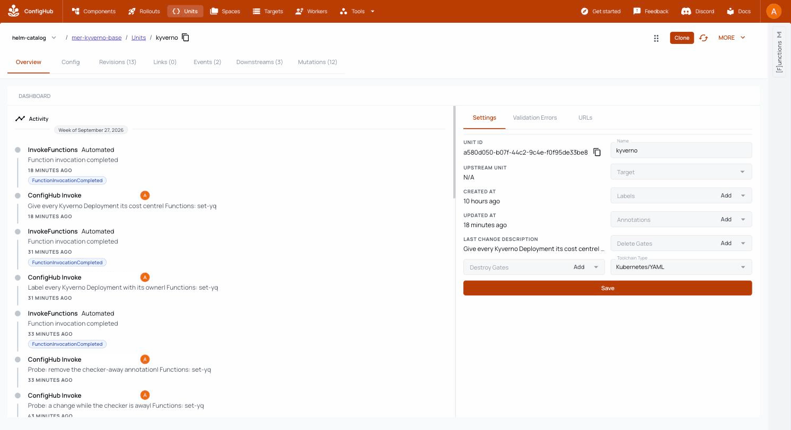
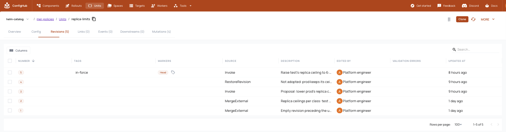

# Check every change against your policies

Your clusters already enforce policies with Kyverno when something is
applied. ConfigHub can run the same policies on a change before it ships, so
a change that breaks one never reaches a cluster, and every stage of a rollout
records that the check passed.

There are two ways to gate a rollout on a check, and they fail differently:

| | A policy trigger (`--policy`) | A required check (`--require PolicyCheck`) |
| --- | --- | --- |
| What runs the check | ConfigHub, on every change, through a worker | You or CI, with `cub sveltos check`, once per stage |
| A failing change | Carries ValidationErrors: it is not promoted past its stage, nor released | Carries a rejection: its release is refused until it is revoked |
| A check that has not run | Is not an error: the change can be released (measured below) | Blocks the release: nothing ships without a recorded Pass |
| Best for | Fast feedback on every edit, in ConfigHub and to AI assistants | The gate you rely on for production |

Use both: the trigger tells authors at once, and the requirement is the gate.

## What you need

- **A Kyverno that holds your policies and checks for ConfigHub.** Run it
  apart from the clusters' own Kyverno, for example on the management cluster
  in its own namespace:

  ```bash
  helm install policy-checker kyverno --repo https://kyverno.github.io/kyverno/ --version 3.8.2 \
    -n policy-checker --create-namespace --set admissionController.replicas=1 \
    --set backgroundController.enabled=false --set cleanupController.enabled=false --set reportsController.enabled=false
  kubectl apply -f your-policies/
  ```

  A cluster's own Kyverno ignores everything in its own namespace
  (`resourceFilters: [*/*,kyverno,*]`). Checked with a workload cluster's
  Kyverno, a change to the Kyverno chart itself always passed.

- **A worker that runs `vet-kyverno-server` against it.** In the cluster,
  follow ConfigHub's [admission webhook
  guide](https://docs.confighub.com/guide/admission-webhook-functions/). To
  try it from your laptop:

  ```bash
  cub worker create --space platform-policies kyverno-checker
  kubectl -n policy-checker port-forward svc/policy-checker-kyverno-svc 18443:443 &
  cub worker run --space platform-policies -f vet-kyverno-server \
    -e KYVERNO_URL=https://localhost:18443 -e KYVERNO_SKIP_TLS_VERIFY=true kyverno-checker
  ```

  The worker must be as new as your ConfigHub server. A worker two months
  older could not read the server's requests ("illegal base64 data").

## A policy trigger: every change is checked

Create the trigger in a Space of its own, in warn mode first, and a Filter
that selects it:

```bash
cub trigger create --space platform-policies --worker platform-policies/kyverno-checker --warn \
  kyverno Mutation Kubernetes/YAML vet-kyverno-server
cub filter create --space platform-policies policy-triggers Trigger --from-space platform-policies
```

Then plan with `--policy`:

```bash
cub sveltos apply onboard/profiles.yaml clusters.yaml <your options> --policy platform-policies/policy-triggers --out onboard
bash onboard/apply.sh
```

`apply.sh` gives every base, class base and variant the filter, and adds
`Validated` to each stage that has a stage ahead of it. On a fleet you
onboarded before, running it again adds the gates to the workflow. Gates and
stage settings you made in ConfigHub since are kept.

In warn mode a failing change gets a warning and nothing is held. That shows
you what the policy would stop. When nothing you mean to ship fails, enforce
it:

```bash
cub trigger update --space platform-policies --worker platform-policies/kyverno-checker --unwarn \
  kyverno Mutation Kubernetes/YAML vet-kyverno-server
```

A Space that uses a trigger from another Space does not see it change until
you refresh it: `cub space update --patch --refresh-triggers <space>`.

Each change is followed by the check. In the root unit's activity, every
change made by a person ("ConfigHub Invoke") is followed by an automated
function invocation, the Kyverno check (author names hidden):



**Measured on the Meridian kind fleet.** A change at the root set the Kyverno
cleanup controller's image to `:latest`, which `disallow-latest-tag` forbids:

- The root carried the ValidationError at once, naming the rule and the
  object: `disallow-latest-tag/autogen-validate-image-tag` on
  `kyverno/kyverno-cleanup-controller`.
- Promotion into test was refused while the class bases held it:
  `unable to promote to stage 'test', Variant 'class-test' has ValidationErrors
  on the Revisions change order 'probe-latest-tag' marks: kyverno
  (mer-policies/kyverno/vet-kyverno-server)`.
- With no entry gate on test, the change reached test1 and was approved, but
  its release was refused: `HTTP 422: outstanding ValidationErrors; triggers
  re-queued for evaluation`. The cluster kept its image.

In ConfigHub, a rollout waiting on its gates. `check/validated` is the policy
gate on uat, which ConfigHub checks when you promote:


The root unit's history keeps each change with the change order that carried
it, and marks the two that failed the policy (author names hidden):


The Rollouts page lists the orders the policy stopped as closed, not promoted:


**Three things to know:**
- **An order keeps the gates it started with.** A change order copies its
  workflow when it is made, so loosening a gate does not free an order already
  under way.
- **An order carries only the changes made before it.** Make the change, then
  create the order. A fix made after the order's first promotion does not
  travel with it.
- **A held order is undone, not fixed.** Give it up with
  `cub changeorder update --patch --aborted-reason "..." <order>`, take it back
  out with `cub variant demote <space> --change-order <base>/<order>` where it
  reached, then fix the change and roll the fix out in a new order.

## When the checker is away

ConfigHub's documentation says a trigger whose worker is disconnected holds
changes with ValidationErrors. After its fail-open time, 6 hours unless set
with `--fail-open-after`, it disables the trigger, and changes go out
unchecked. This was measured on ConfigHub v0.6.5, with the trigger's fail-open
time set to 2 minutes and the worker stopped:

- **ConfigHub did not notice.** Twenty-five minutes later the worker still read
  `Ready`, its last-seen time frozen at the moment it stopped, and the trigger
  was never disabled. So the six-hour clock never started.
- **A change made in that window was never checked**, carried no error, and
  was released to test1. uat's `Validated` gate let it through as well. Both
  gates read a missing result as a pass.
- **When the worker came back, nothing re-checked it.** Revisions made while
  it was away stay unchecked until they change again, or until you run
  `cub space update --patch --refresh-triggers <space>`.

So a policy trigger alone can let changes through, sooner than six hours.
Treat it as feedback, and gate releases on a required check. This is reported
to ConfigHub as confighubai/confighub#5530.

## A required check: nothing ships without a Pass

This uses ConfigHub's attestation requirements (confighubai/confighub#5476).
Plan with `--require`:

```bash
cub sveltos apply onboard/profiles.yaml clusters.yaml <your options> --require PolicyCheck --out onboard
```

Each stage's release now waits for a PolicyCheck attestation as well as the
approval. Record one with `cub sveltos check`, after promoting into a stage:

```bash
cub sveltos check --change-order sveltos-kyverno-base/cost-center --stage test \
  --worker platform-policies/kyverno-checker vet-kyverno-server
```

```
mer-kyverno-eu-central-test1: passed kyverno/10; recorded a Pass (dae879e6-f5bf-453a-ad41-bc5678096878)
```

Or judge it with the same sandbox and policies as the preview, with no worker
(see [the fix, and the gates](#the-fix-and-the-gates)):

```bash
cub sveltos check --change-order mer-kyverno-base/six-replicas-in-test --stage test \
  --sandbox-kubeconfig sandbox.kubeconfig --policy mer-policies@Tag:in-force
```

For each variant the order has reached in the stage, it checks exactly the
revisions the order marks there. Then it records a Pass, or a rejection that
holds the release until someone revokes it. It exits non-zero on a failure,
so CI can run it.

**Measured.** Approved but not checked, a release was refused: `requires
policycheck: 1 PolicyCheck attestation(s) from eligible attesters; kyverno
revision 9 has 0 of 1`. The Meridian rollout that followed recorded an
approval and a PolicyCheck Pass in each of test, uat and prod. The order ended
`Completed`, `Released`, with 6 approvals and 6 PolicyCheck attestations, one
of each per variant.

`cub sveltos watch` keeps working with a requirement: a joining cluster waits
for its check as well as its approval, and the watcher prints the
`cub attestation create` it needs.

### Prod as staging ran it: a parity check

A change that passed staging can still fail in prod when prod holds something
staging does not: a memory limit set in prod's class base and declared nowhere.
`check --parity-with` compares each variant of a stage with the variants of an
earlier stage, field by field. On each side it reads every unit at the revision
the order marks, or, where it marks none, at the last release: what each
variant runs, or will run.

```bash
cub sveltos check --change-order shop-base/bigger-cache --stage prod --parity-with staging
```

A prod variant may depart from staging only where a guard declares it. Record
the guard with `cub unit set-guard`, on the field, on a path that holds it, or
on the whole object, with the reason as its value. An object only prod has is
declared by a guard on the object. The check reads the guards as they stand
when it runs.

```bash
cub unit set-guard shop --space shop-prod-eu \
  --guard "apps/v1/Deployment:shop/api:spec.replicas=departure=prod-capacity"
```

Any other difference fails the check, naming the field and both values (a
Secret's values are never shown, only that they differ). So does a unit
staging runs and prod does not. Lists Kubernetes merges by a field other than
`name`, such as `ports` and `volumeMounts`, are compared whole: declare them on
the list.

```
shop-prod-us: FAILED on shop/9; recorded a rejection (...), which holds its release:
  - shop/9: Deployment shop/api spec.template.spec.containers[api].resources.limits.memory is "48Mi" here and unset in shop-staging, and no guard departure=<why> declares it
```

The verdict is recorded as a ParityCheck attestation. The command prints each
declared departure with its reason, and the Pass's note names as many as fit,
with their count, so whoever approves prod can see them. Use `--declared-by` to
declare with a guard key other than `departure`.

The check should gate prod alone, since staging has no earlier stage to match.
`--require` gates every stage, so add the requirement to prod's stage of the
workflow instead:

```bash
cub changeworkflow update --space shop-base rollout \
  --attestation-prerequisite approval --attestation-prerequisite parity \
  --attestation-prerequisite-type parity=ParityCheck \
  --stage-release-prerequisites 'prod=approval;parity'
```

Name every attestation prerequisite the workflow keeps: the list given is the
list it has. A change order copies its workflow when it is created, so the
requirement holds for orders created after this edit. Any ParityCheck counts,
whoever records it; to count only the identity that runs the check, add
`--attestation-prerequisite-from-user-ids parity=<user ID>`.

A guard is a declaration, not a permission: anyone who can edit the unit can
add one. What it gives is a reason on the record, read by the check and shown to
the approver. ConfigHub also enforces it: a later write to that path, a
promotion included, is withheld as a conflict unless cleared for the reason,
and changing the guard itself needs `--clearance`.

## Before anything ships: preview a change's impact

The gates stop a change that breaks a policy. `cub sveltos impact` answers the
question before that, in both directions:
- **A proposed change against each cluster's own policies:** what will its
  next promotion bring, and will that cluster's policies accept it?
- **A proposed policy against every configuration already running:** what
  would it refuse, and, with the changes ConfigHub refused before, what would
  it newly let through?

It evaluates each target twice in a **sandbox**: a disposable API server that
holds policies and nothing else. It runs once under the policies in force, and
once under the candidate. Each object a policy matches is submitted with a
server-side dry run, so the verdict is the API server's own, and nothing is
created. Each object comes out as one of four:
- **newly denied:** passes today, refused under the candidate;
- **newly allowed:** refused today, passes under the candidate;
- **unchanged;**
- **unknown:** the verdict needs what the configuration does not hold, such as
  the requesting user.

Each row names the target, the revision it runs (and, for a proposal, the
revision it would take), the object, and the API server's own message. A row
that is denied or unknown also names the policy revision behind it.

Here is what a policy change's preview could look like inside ConfigHub. This
is a mock ([docs/mock/policy-impact.html](../mock/policy-impact.html)), filled
with real output of `cub sveltos impact --json`
([policy-impact.json](../mock/policy-impact.json)): the proposal from step 2 of
the recording below, evaluated again at the end of it with its revisions
pinned (`--policy mer-policies/disallow-latest-tag@2 --policy
mer-policies/replica-limits@2 --candidate mer-policies/replica-limits@3 --tests
mer-policies/policy-tests@3`):


**The sandbox.** Name it every time, with `--sandbox-kubeconfig` or
`--sandbox-context`. Its admission policies are replaced, and others removed,
so `impact` and `check` never take the current context as the sandbox. They
also refuse a cluster that runs a Deployment, StatefulSet or DaemonSet outside
`kube-system` and `local-path-storage`. Measured, before that rule existed: run
with no sandbox named, from a shell whose context was a management cluster, the
preview put its policy there, and Sveltos was refused its own writes until a
release replaced the policy.

A new kind cluster made for the purpose passes as it is:

```bash
kind create cluster --name policy-sandbox --kubeconfig sandbox.kubeconfig
```

The policies select each target's stage through the namespace label
`impact.confighub.com/stage`, which the tool sets on the namespace it gives
each target. The Meridian example's policies are in
[examples/meridian-slice/policies](../../examples/meridian-slice/policies).

### Keep the policies in ConfigHub

A policy is configuration too. Put each one in a unit of its own, in a Space
for policies, and tag the revisions in force:

```bash
cub unit create --space mer-policies replica-limits policies/replica-limits.yaml
cub unit create --space mer-policies disallow-latest-tag policies/disallow-latest-tag.yaml
cub tag create --space mer-policies in-force
cub unit tag in-force --space mer-policies --unit replica-limits,disallow-latest-tag
```

A policy change is then a new revision, like any other change. Preview it,
have a person approve it, and move the tag to put it in force. A proposal
nobody adopts is taken back out with `cub unit update --restore`, and the tag
never moves. In ConfigHub, the history of `replica-limits` after the recording:
revision 3 proposed prod's ceiling at 2 and was taken back out by revision 4,
and revision 5, test's ceiling at 6, is the one tagged `in-force`:



`--policy` and `--candidate` take a policy source:

| Source | Reads |
| --- | --- |
| `mer-policies@Tag:in-force` | every unit in the Space at the revision the tag marks; a unit the tag does not mark is not in force |
| `mer-policies/replica-limits` | the unit's head: usually the proposal |
| `mer-policies/replica-limits@3` | revision 3 |
| `policies/replica-limits.yaml` | a file |

### Known cases

The running fleet only shows what runs today. Known cases say what each
policy must refuse and what it must admit. Each case is an object annotated
with the stage it meets and the verdict it expects
([policies/tests.yaml](../../examples/meridian-slice/policies/tests.yaml)):

```yaml
metadata:
  name: test-five-replicas
  annotations:
    impact.confighub.com/stage: test
    impact.confighub.com/expect: denied
```

Keep them in ConfigHub beside the policies, and pass them with `--tests`. A
case the policies in force get wrong is reported. So is a known-bad case a
candidate would admit, or a known-good one it would refuse.

### A policy change against the fleet

Lowering prod's replica ceiling from 5 to 2, proposed as revision 3 of
`replica-limits`:

```bash
cub function set --space mer-policies --unit replica-limits --change-desc "Proposal: lower prod's replica ceiling to 2" \
  -- set-yq '(select(.kind == "ConfigMap" and .metadata.name == "replica-limits-prod") | .data.max) = "2"'
cub sveltos impact --sandbox-kubeconfig sandbox.kubeconfig --component mer-kyverno \
  --policy mer-policies@Tag:in-force --candidate mer-policies/replica-limits \
  --tests mer-policies/policy-tests@Tag:in-force
```

```text
policies in force: mer-policies/disallow-latest-tag@2, mer-policies/replica-limits@2
candidate:         mer-policies/replica-limits@3

TARGET                            STAGE  CONFIG     OBJECT                                   NOW      THEN    VERDICT                         POLICY
eu-central-prod1                  prod   kyverno@6  Deployment kyverno-admission-controller  allowed  denied  newly denied                    mer-policies/replica-limits@3
...
tests/prod-pinned-three-replicas  prod   ...        Deployment prod-pinned-three-replicas    allowed  denied  newly denied (expects allowed)  mer-policies/replica-limits@3

tests: under the candidate, these cases no longer behave as expected:
  - tests/prod-pinned-three-replicas: expects allowed, and the candidate gives denied
```

The four prod clusters are newly denied, each at the revision it runs, and a
known-good case says the proposal also refuses three replicas in prod. A
ValidatingAdmissionPolicy does not evict what runs: newly denied means the
cluster's next create or update of that object would be refused.

### What a weaker policy lets through

Everything running already passes, so the running configurations cannot show
what a weaker policy would allow. The changes that were refused can.
`--corpus <space>` adds the revisions ConfigHub recorded as failing a policy,
and the known cases add the ones you wrote down. Exempting Kyverno's
controllers from `disallow-latest-tag` newly allows the two root revisions
that once put the cleanup controller on `:latest`, and the `latest-tag` case
says the proposal admits what it must refuse. Newly allowed is only as complete
as the corpus and the cases.

### A proposed change against each cluster's policies

Make the change, open its change order, and promote it into the class bases
only. Then `--next` compares what each cluster runs with what its next
promotion brings. On the Meridian slice, 6 admission controller replicas in
test's class base meet test's ceiling of 4:

```text
TARGET            STAGE  CONFIG                                           OBJECT                                   NOW      THEN    VERDICT       POLICY                         WHY
eu-central-test1  test   kyverno@10 -> mer-kyverno-class-test/kyverno@15  Deployment kyverno-admission-controller  allowed  denied  newly denied  mer-policies/replica-limits@2  replica-limits (binding replica-limits-test): replicas 6 is above the ceiling of 4 for this class

1 newly denied, 0 newly allowed, 23 unchanged, 0 unknown
```

With `--candidate` as well, `--next` previews the change and a policy change
together: each cluster's next promotion under the proposed policies.

### An assistant explains, and a person decides

[`explain/explain.sh`](../../examples/meridian-slice/explain/explain.sh) gives
the results, as `--json`, to an assistant (Claude Code in print mode), which
may read ConfigHub with read-only `cub` commands. Its fixed prompt
([prompt.md](../../examples/meridian-slice/explain/prompt.md)) asks it to
explain why the targets differ, group the causes, name the smallest correction
per target, and compare three ways out: fix the application, correct the
policy, or ask for an exception. It makes no verdict and approves nothing.

On the Meridian proposal it found that test was already at its ceiling, and
warned that raising the policy would put test's ceiling above prod's
([its answer, as written](../../examples/meridian-slice/explain/explain-2026-09-29.md)).

### The fix, and the gates

The person chose to correct the policy, deliberately: test is where replica
counts are tried before prod. That is a new revision of `replica-limits`,
previewed together with the proposal (nothing newly denied; five and six
replicas become allowed in test, seven are still refused), with the known case
changed in the same proposal. It was approved and tagged:

```bash
cub attestation create --space mer-policies --where "Slug = 'replica-limits'" --type Approval --note "..."
cub unit tag in-force --space mer-policies --unit replica-limits,policy-tests
```

Then the change went through the gates, and `cub sveltos check` judged it with
the same sandbox and the policies in force, rather than a worker function:

```bash
cub sveltos check --change-order mer-kyverno-base/six-replicas-in-test --stage test \
  --sandbox-kubeconfig sandbox.kubeconfig --policy mer-policies@Tag:in-force
```

```text
mer-kyverno-eu-central-test1: passed kyverno/11; recorded a Pass (c6d95ef1-5489-46c6-aec3-a8ddbf177539)
```

The PolicyCheck it records names the policy revisions it was judged by
(`check.confighub.com/policies=mer-policies/disallow-latest-tag@2,mer-policies/replica-limits@5`),
so the change is released under exactly the policies it was previewed against.
With a person's approval the release was published, and Sveltos delivered
it: at 22:36:40, under three minutes after the step began, eu-central-test1 ran
6 admission controller replicas, 6 of 6 ready. uat and
prod protect their replicas, so the order brought nothing new there, and it
ended `Completed`, `Released`.

### Unknown

A policy that reads the requesting user (`request.userInfo`), the previous
object (`oldObject`), the namespace object, or the authorizer cannot be judged
from configuration. The row says so and names what is missing. Proposed as a
new unit, `platform-team-only` came out unknown on all 24 objects it matches.

### Measured, and worth knowing

- **A deleted policy's successors can read stale parameters.** On Kubernetes
  v1.35, once a ValidatingAdmissionPolicy is deleted, the parameters its
  successors read stay as they were until the API server restarts. So the tool
  applies policies in place, removes only a policy neither set has, and says
  when it did. If a result looks wrong after that, restart the sandbox's API
  server (`docker restart <sandbox>-control-plane` for kind) and run again.
- **A demote leaves a unit counted as upgraded.** A proposal of 6 replicas at
  the root, given up with `cub variant demote` on 28 September, was proposed
  again a day later. Test's class base did not take it: the demote had
  restored its data, but it stayed counted as upgraded to the old proposal, so
  the new one was no change to it. Check a promotion's result before
  previewing, or make the change where it lands.

Recorded on the Meridian slice:
[demo-2026-09-29.log](../../examples/meridian-slice/demo-2026-09-29.log) (policies in
ConfigHub, known cases, the assistant, and the fix through the gates) and
[impact-2026-09-28.log](../../examples/meridian-slice/impact-2026-09-28.log)
(policies as files). The same preview inside ConfigHub itself is
confighubai/confighub#5325.
