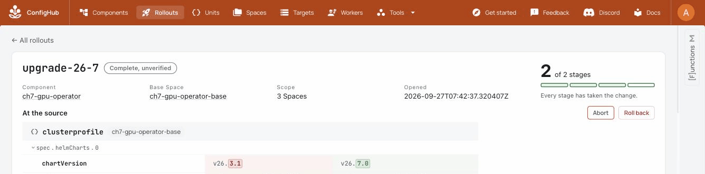

# Chapter seven: the GPU operator on exactly the clusters approved for it

Many GPU fleets install NVIDIA's GPU operator the way the ECMWF platform team
described theirs at ISGC 2026: one Sveltos profile, and every cluster
labelled `addons.gpu-operator: enabled` gets the operator and its drivers. A
label edit decides where GPU drivers go, and nothing records who decided. One
mislabelled cluster gets drivers it should not have.

This chapter takes that fleet onto one ConfigHub variant per cluster with
`cub sveltos`, then does the three things a GPU fleet does: it enables the
operator on one more cluster, survives a mislabel, and upgrades the operator
and its driver on staging before prod.

## The input

[gpu-fleet.yaml](gpu-fleet.yaml) is the fleet as its owner describes it
today: the label-selector profile and the clusters it picks from. The chart
and values are NVIDIA's AI Cluster Runtime recipe `h100-any`, from
[confighub/helm-expt](https://github.com/confighub/helm-expt/tree/main/examples/aicr/h100-any),
136 lines of reviewed values including DCGM metrics, MIG and GPUDirect. The
operator and driver start pinned to the previous release pair that AICR's
EKS H100 recipes carry, chart `v26.3.1` with driver `580.126.20`. The
chapter's change moves them to `h100-any` as published, chart `v26.7.0` with
driver `580.173.02`. Every version in it is NVIDIA's.

| Cluster | Labels | GPU operator today |
| --- | --- | --- |
| `gpu-a` | `env=staging`, `accelerator=h100`, `addons.gpu-operator=enabled` | yes |
| `gpu-b` | `env=prod`, `accelerator=h100` | not yet |
| `cpu-c` | `env=prod` | never: it has no GPUs |

## What was recorded

Recorded on kind on 2026-09-27 with stock Sveltos v1.15.0 and `cub sveltos`
built from this repository, by running [run.sh](run.sh) against a fleet from
[kind-fleet.mjs](kind-fleet.mjs). The full output is
[rehearsal-2026-09-27.log](rehearsal-2026-09-27.log).

| Step | Measured |
| --- | --- |
| Before | gpu-a runs `gpu-operator-v26.3.1`, and its ClusterPolicy asks for driver `580.126.20`. gpu-b and cpu-c run nothing. |
| Onboard: plan, apply, takeover | gpu-a kept the same Helm revision and the same operator pod. Nothing was reinstalled. |
| gpu-b is labelled | A minute later the label alone had shipped nothing. The re-plan proposed a gpu-b variant in the prod stage. `apply.sh` added the prod stage to the workflow and released gpu-b, which came up at `v26.3.1` with driver `580.126.20`, the base as it stood. |
| cpu-c is labelled by mistake | A minute later nothing had shipped. The plan showed the cpu-c variant it would add, for a reviewer to refuse. It was not applied, and the label was removed. |
| Upgrade, staging first | ConfigHub refused prod before staging had released: `unable to promote to stage 'prod', Variant 'gpu-a' has taken change order 'upgrade-26-7' but has not released it`. gpu-a moved to `v26.7.0` and driver `580.173.02` while gpu-b stayed on `v26.3.1` and `580.126.20`. Then gpu-b moved after its own approval. |



## What kind cannot show

kind nodes have no GPUs. The operator ran and reconciled, and its
ClusterPolicy reported `ready` with the driver version the variant asked for.
But no node is labelled `nvidia.com/gpu.present`, so the operator created no
GPU daemonsets, and no driver, toolkit or device plugin ran. The chapter
proves governance, delivery, the takeover of a live GPU profile, and a staged
operator and driver upgrade. Proving that the drivers come up needs real GPU
nodes. That lane is the eks-inference stack, and it costs cloud money, so it
waits for a go-ahead ([#48](https://github.com/confighub/sveltos-confighub/issues/48)).

## Two things this chapter teaches

**Different accelerators are classes.** An H100 cluster and an RTX Pro 6000
cluster run different AICR recipes. Keep one profile per recipe, each
selecting its accelerator, and onboard with `--class-label accelerator`: they
become one component with a class base per accelerator, each holding its own
values, and a chart upgrade made once on the root reaches both. Per-cluster
values departures would hold the same differences, but chart values are one
string field, and when a base change and a departure touch the same field,
ConfigHub keeps the departure and drops the change without saying so: every
values change would have to be made cluster by cluster.

**Reviewing a values change is harder than it should be.** ConfigHub's
Rollouts view highlights the chart version change, but it shows the 136 lines
of values as one block. The driver change inside it is not highlighted. For
GPU fleets, where the risky change usually sits inside values, that is the
review surface to improve.

## Run it yourself

With `cub` logged in to an organization that has 5 Spaces free, and kind,
kubectl and helm installed:

```bash
cub plugin install confighub/sveltos-confighub
node examples/gpu-operator/kind-fleet.mjs
bash examples/gpu-operator/run.sh
node examples/gpu-operator/kind-fleet.mjs --delete
```

`run.sh` keeps its five `ch7-` Spaces, so you can look at the fleet in
ConfigHub afterwards. Delete them with
`cub space delete <space> --recursive-force` when you are done.
