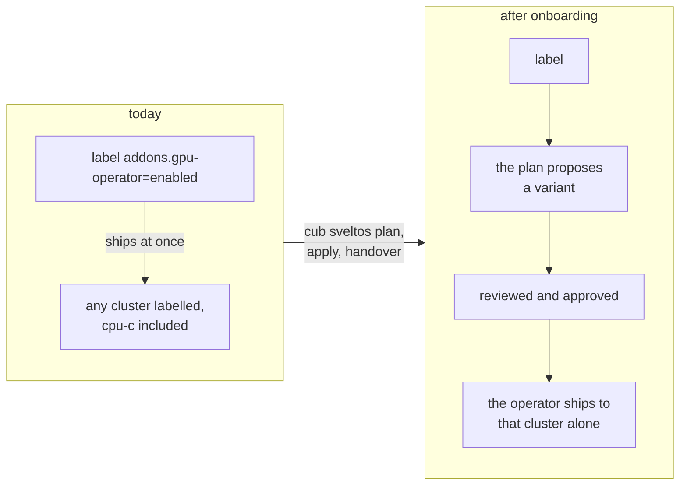
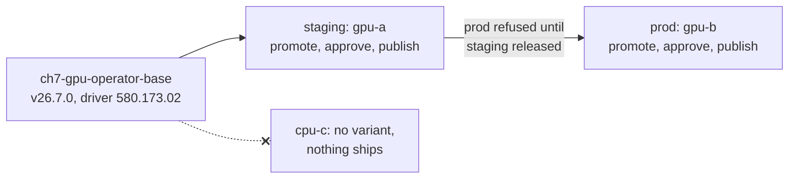

# Chapter seven: the GPU operator on exactly the clusters approved for it

Many GPU fleets install NVIDIA's GPU operator the way the ECMWF platform team
described theirs at ISGC 2026: one Sveltos profile, and every cluster
labelled `addons.gpu-operator: enabled` gets the operator and its drivers. A
label edit decides where GPU drivers go, and nothing records who decided. One
mislabelled cluster gets drivers it should not have.

This chapter takes that fleet onto one ConfigHub variant per cluster with
`cub sveltos`, then does the three things a GPU fleet does: it enables the
operator on one more cluster, survives a mislabel, and upgrades the operator
and its driver on staging before prod. ConfigHub holds the operator as the
objects the chart renders to, the ClusterPolicy among them, so the driver
version a reviewer approves is a field, `spec.driver.version`, not a line
inside a values string.



## The input

[gpu-fleet.yaml](gpu-fleet.yaml) is the fleet as its owner describes it
today: the label-selector profile and the clusters it picks from. The chart
and values are NVIDIA's AI Cluster Runtime recipe `h100-any`, from
[confighub/helm-expt](https://github.com/confighub/helm-expt/tree/main/examples/aicr/h100-any),
136 lines of reviewed values including DCGM metrics, MIG and GPUDirect. The
operator and driver start pinned to the previous release pair that AICR's
EKS H100 recipes carry, chart `v26.3.1` with driver `580.126.20`. The
chapter's change moves them to `h100-any` as published, chart `v26.7.0` with
driver `580.173.02`. Every version in it is NVIDIA's.

| Cluster | Labels | GPU operator today |
| --- | --- | --- |
| `gpu-a` | `env=staging`, `accelerator=h100`, `addons.gpu-operator=enabled` | yes |
| `gpu-b` | `env=prod`, `accelerator=h100` | not yet |
| `cpu-c` | `env=prod` | never: it has no GPUs |

## What was recorded

Recorded on kind on 2026-09-27 with stock Sveltos v1.15.0 and `cub sveltos`
built from this repository, by running [run.sh](run.sh) against a fleet from
[kind-fleet.mjs](kind-fleet.mjs). The full output is
[rehearsal-2026-09-27.log](rehearsal-2026-09-27.log).

| Step | Measured |
| --- | --- |
| Before | gpu-a runs the operator v26.3.1 with driver 580.126.20, from the one label-selector profile. gpu-b and cpu-c run nothing. |
| Onboard: plan, apply, handover | The base holds the operator as one unit of 11 objects, 2 of them CRDs, rendered from NVIDIA's chart with the recipe's values. gpu-a gets one variant: 4 Spaces and 1 Link in all. The chart's four Helm hooks, for upgrade, delete or test, are left out. The handover set the live profile aside, and gpu-a's delivery profile took over with the same operator pod and driver: nothing was reinstalled. |
| gpu-b is labelled | A minute after the label, nothing had shipped. Onboarding again from `onboard/profiles.yaml` added gpu-b's variant in the prod stage. Its release brought the operator and driver 580.126.20 to a cluster that had nothing. The chart lists its ClusterPolicy before the ClusterPolicy CRD; with `continueOnError: true` the CRDs land first and the ClusterPolicy on the retry. |
| cpu-c is labelled by mistake | A minute later, nothing had shipped to cpu-c. The plan shows the variant a reviewer would refuse. The label was removed, and nothing was applied. |
| Upgrade, staging first | The v26.7.0 rendering, with the driver moved to 580.173.02, replaced the base's unit. ConfigHub's diff lists it object by object: 20 paths of the ClusterPolicy (every operand's version, `spec.driver.version` among them, and one new field), 4 of the operator's Deployment (its image among them), 12 of RBAC rules, 120 of CRD schema, and 3 new CRDs. Prod was refused while staging had the change unreleased. gpu-a then ran v26.7.0 with 580.173.02, then gpu-b, and the change order ended `Completed`, `Released`. |

The upgrade, as it moved:



## What kind cannot show

kind nodes have no GPUs. The operator ran and reconciled, and its
ClusterPolicy reported `ready` with the driver version the variant asked for.
But no node is labelled `nvidia.com/gpu.present`, so the operator created no
GPU daemonsets, and no driver, toolkit or device plugin ran. The chapter
proves governance, delivery, the handover of a live GPU profile, and a staged
operator and driver upgrade. Proving that the drivers come up needs real GPU
nodes. That lane is the eks-inference stack, and it costs cloud money, so it
waits for a go-ahead ([#48](https://github.com/confighub/sveltos-confighub/issues/48)).

## Two things this chapter teaches

**Different accelerators are classes.** An H100 cluster and an RTX Pro 6000
cluster run different AICR recipes. Keep one profile per recipe, each
selecting its accelerator, and onboard with `--class-label accelerator`: they
become one component with a class base per accelerator, each holding the
fields and objects its recipe renders differently, protected, and a chart
upgrade made once reaches both.

**Review sees the driver, and what else the chart changed.** The upgrade
renders the new chart version with the new driver in its values, the way
`apply.sh` notes the chart was rendered, and stores it on the base. The diff
a reviewer approves shows the ClusterPolicy's `spec.driver.version` and the
operator's image as fields of their own. It also shows what the chart itself
changed between versions: new RBAC rules for the operator and three new
CRDs. An earlier version of this chapter stored the profile itself in
ConfigHub, and review showed 136 lines of values as one block with the
driver change inside it; the chart's own changes did not show at all.

## Run it yourself

With `cub` logged in to an organization that has 5 Spaces free, and kind,
kubectl and helm installed:

```bash
cub plugin install confighub/sveltos-confighub
cub plugin install confighub/cub-helm
node examples/gpu-operator/kind-fleet.mjs
bash examples/gpu-operator/run.sh
node examples/gpu-operator/kind-fleet.mjs --delete
```

`run.sh` keeps its five `ch7-` Spaces, so you can look at the fleet in
ConfigHub afterwards. Delete them with
`cub space delete <space> --recursive-force` when you are done.
