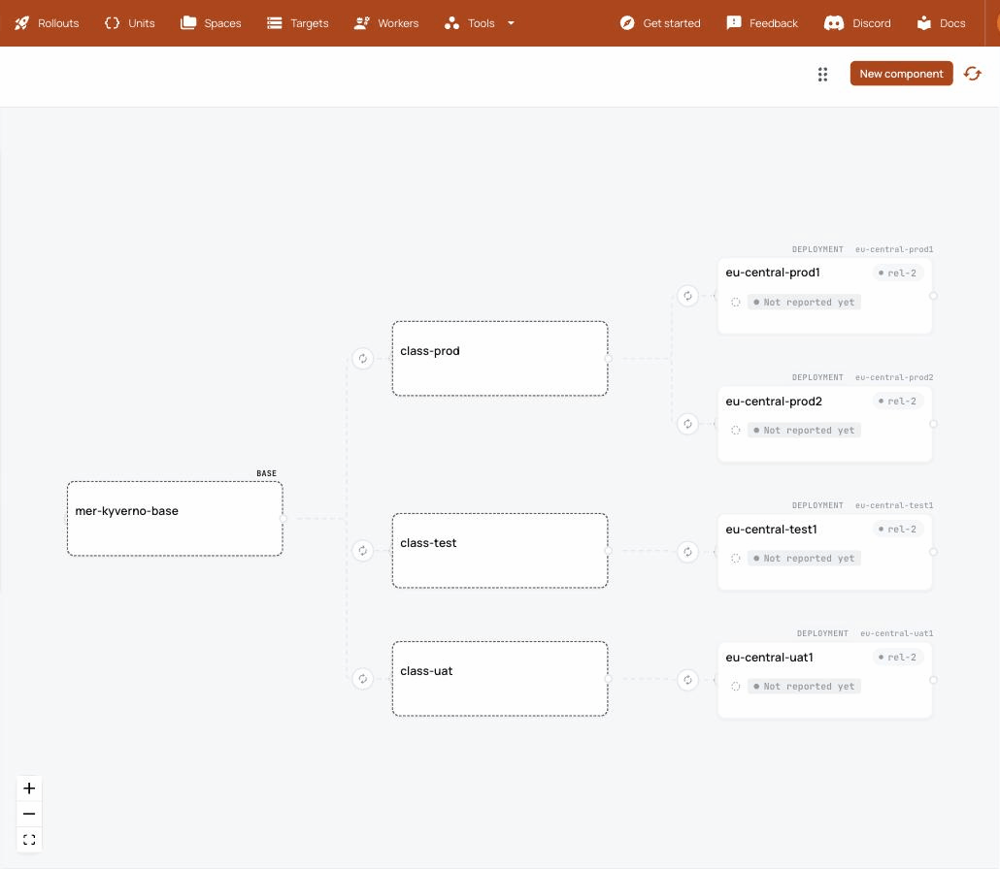

# A slice of Meridian, delivered by Sveltos

Meridian is the fleet ConfigHub's demo tool builds: a synthetic Meridian
Group with 99 clusters across 8 regions, 4 classes (dev, test, uat, prod) and
3 departments. It lives in [confighub/cub-demo](https://github.com/confighub/cub-demo)
(`scenarios/meridian.yaml`). Every component there is a tree of three levels:

- a root base;
- a class base per class, holding what that class differs in (Meridian's
  class knobs: replicas 1 for test, 2 for uat, 3 for prod);
- one deployment per cluster, cloned from its class base.

Meridian is synthetic. Its clusters are Targets on a server-hosted worker,
and its live status is generated.

This slice makes part of it real with Sveltos. It takes the shared
eu-central clusters that Meridian places Kyverno on, `eu-central-test1`,
`-uat1`, `-prod1` and `-prod2`, named and labelled the Meridian way, and
starts where a Sveltos user carrying Meridian's class knobs would be today:
one Kyverno profile per class, each selecting its class and setting its
replicas ([meridian-slice.yaml](meridian-slice.yaml)).

```bash
cub sveltos plan examples/meridian-slice/meridian-slice.yaml \
  --class-label class --stage-label class --stages test,uat,prod
```

`--class-label class` makes the three profiles one component in Meridian's
shape. The prod profile becomes the root base. Each class gets a class base
holding its replicas, and each cluster's deployment is cloned from its class
base. The Spaces carry Meridian's `Role` and `Cluster` labels, so Meridian's
queries (`Labels.Role = 'base'`, `Labels.Role = 'deployment'`) find them.



## What was recorded

Recorded on kind on 2026-09-27 with stock Sveltos v1.15.0 and Kyverno, by
running [run.sh](run.sh) against a fleet from
[kind-fleet.mjs](kind-fleet.mjs). The full output is
[rehearsal-2026-09-27.log](rehearsal-2026-09-27.log).

| Step | Measured |
| --- | --- |
| Before | Kyverno 3.8.1 on all four clusters. The admission controller runs 1 replica on test, 2 on uat and 3 on both prod clusters, set by the three per-class profiles. |
| Onboard: plan, apply, takeover | The three profiles became one component with a class base per class. `takeover.sh` handed all three over, and every cluster kept its release revision and its class's replicas. |
| One change at the root, Kyverno 3.8.1 to 3.8.2 | The `bases` stage carried it into the three class bases, each keeping its replicas. ConfigHub refused uat until test had taken the change. Test, then uat, then both prod clusters moved to 3.8.2, each still at its class's replicas, and the change order finished `Completed` and `Released`. |

## The rule the three levels come with

When the base changes a setting that a class or a cluster overrides, the
base's value replaces the override, and the promotion reports nothing.
Changes to different settings both survive, even inside the same Helm values
string. Protecting the override with `cub unit set-protection` did not hold
for Helm values, because ConfigHub identifies the entries of a chart list by
their content (measured 2026-09-27).

Here each class overrides its replicas, so replicas are changed on the class
bases, never on the root: a root change to them would replace every class's
value. The chart upgrade above changed a different field, so it could be made
once on the root.

## What this slice is not

It is four clusters of Meridian's 99 and one of its 19 components. Its
deployments show "Not reported yet" where Meridian shows generated live
status: nothing reports Sveltos's view to ConfigHub until the status reporter
([#33](https://github.com/confighub/sveltos-confighub/issues/33)) exists. At
full size the same shape needs about 1,200 Spaces, as the Meridian README
says, so an organization onboarding at that scale asks for its quota to be
raised first. `cub sveltos plan` prints the count.

## Run it yourself

With `cub` logged in to an organization that has 10 Spaces free, and kind,
kubectl and helm installed:

```bash
cub plugin install confighub/sveltos-confighub
node examples/meridian-slice/kind-fleet.mjs
bash examples/meridian-slice/run.sh
node examples/meridian-slice/kind-fleet.mjs --delete
```

`run.sh` keeps its ten `mer-` Spaces, so the tree above can be opened in
ConfigHub.
