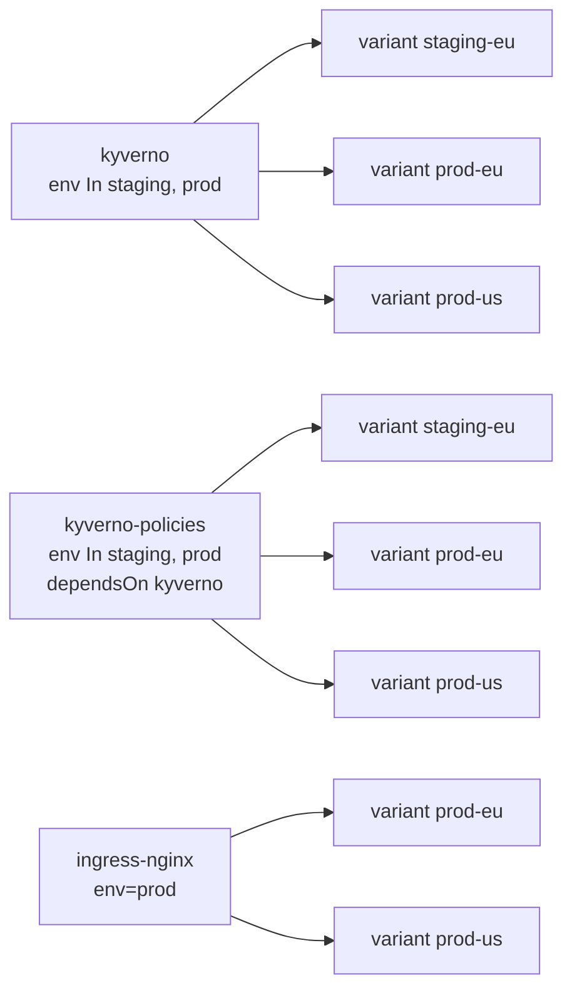

# Onboarding example

What `cub sveltos` does with a small fleet, committed so you can read it
before running anything against your own:

- [my-fleet.yaml](my-fleet.yaml): the input, in Sveltos's own terms: three
  label-selector ClusterProfiles (Kyverno, ingress-nginx, and Kyverno
  policies from a ConfigMap), the ConfigMap, and the SveltosClusters they
  select.
- [plan.txt](plan.txt): what `cub sveltos plan my-fleet.yaml --stage-label env
  --stages staging,prod --include-hooks ingress-nginx` prints.
- [apply/](apply/): what `apply` writes with the same options:
  [apply.sh](apply/apply.sh), each profile's workflow and chart values, the
  policies as the objects they are, the management cluster's delivery
  profiles, and `profiles.yaml`, the profiles and ConfigMaps to plan a
  joining cluster from. `apply` also writes each chart rendered to its objects,
  `apply/kyverno/kyverno.yaml` (71 objects, over 5 MB with its CRDs) and
  `apply/ingress-nginx/ingress-nginx.yaml`; they are left out here for their
  size, and `internal/onboard/testdata/renders` keeps what `cub helm template`
  printed for them.

The fleet has four workload clusters: staging-eu, prod-eu, prod-us, and
dev-1, which no profile selects. Each profile becomes a base, with one
variant per cluster it selects:



Eight variants in all, and a delivery profile for each. A fifth cluster,
staging-us, joins later in the run.

`go test ./...` checks that these files are what the plugin writes today;
`go test ./internal/onboard -update` regenerates them, and `-record` renders
the charts again with `cub helm`. The guide is
[Onboard your Sveltos fleet](../../docs/user/onboard-your-sveltos-fleet.md).

## Run it yourself

The whole journey on kind: live label-selector profiles, plan, apply, the
handover with nothing reinstalled, a chart upgrade and a field change
released together through the stages, and a cluster joining. With `cub`
logged in to an organization that has 15 Spaces free, and kind, kubectl and
helm installed:

```bash
cub plugin install confighub/sveltos-confighub
cub plugin install confighub/cub-helm
node examples/onboard/kind-fleet.mjs
bash examples/onboard/run.sh
node examples/onboard/kind-fleet.mjs --delete
```

`run.sh` keeps its `ob-` Spaces, so the fleet can be opened in ConfigHub.

The run recorded on 2026-09-27 is
[rehearsal-2026-09-27.log](rehearsal-2026-09-27.log), and
[the rehearsal record](../../docs/planning/onboarding-rehearsal.md) reads it
step by step. It predates two defaults found later: delivery profiles set
`continueOnError: true`, and promotions use `--squash`. It needed neither:
Kyverno's rendering puts no custom resource before its CRD, the policy
comes through its own profile after Kyverno's, and the fleet has no class
bases for a change to be replayed past.
